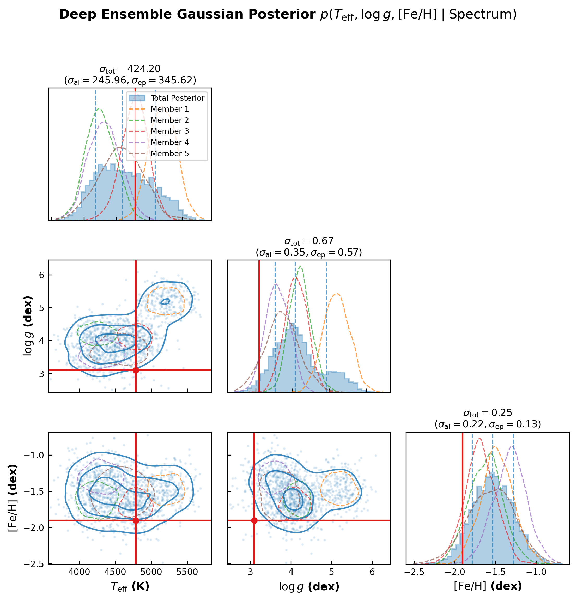

# Stellar Spectra Estimation with Deep Ensembles

> ← [Stellar Spectra Flows & Corner Plot](stellar_spectra_flow_corner.md) | [Ensemble of Normalizing Flows](stellar_spectra_ensemble_flows.md) →

This example demonstrates how to use **Deep Ensembles** in `torchregress` for multi-target heteroscedastic regression on 1D stellar spectra $x \in \mathbb{R}^{1000}$ to estimate physical stellar parameters ($T_{\mathrm{eff}}$, $\log g$, $[\mathrm{Fe/H}]$).

---

## 1. Why Ensembles for Multi-Target Regression?

While a single neural network predicts expected values and aleatoric (data) noise, it cannot quantify **epistemic uncertainty** — model uncertainty caused by limited training data or out-of-distribution spectra.

A **Deep Ensemble** trains $M$ independent member networks with different random initializations and data shuffling orders.

$$\mu_{\text{ens}}(\mathbf{x}) = \frac{1}{M} \sum_{m=1}^M \mu_m(\mathbf{x})$$

$$\sigma_{\text{total}}^2(\mathbf{x}) = \underbrace{\frac{1}{M} \sum_{m=1}^M \sigma_m^2(\mathbf{x})}_{\text{Aleatoric Noise } (\sigma_{\text{al}}^2)} + \underbrace{\frac{1}{M} \sum_{m=1}^M \bigl(\mu_m(\mathbf{x}) - \mu_{\text{ens}}(\mathbf{x})\bigr)^2}_{\text{Epistemic Uncertainty } (\sigma_{\text{ep}}^2)}$$

---

## 2. Architecture & Formulation

Given 1D spectrum $\mathbf{x} \in \mathbb{R}^{1000}$ and target parameters $\mathbf{y} \in \mathbb{R}^3$:

$$\mathbf{x} \xrightarrow{\text{CNN Member } m} \bigl[\boldsymbol\mu_m(\mathbf{x}),\, \log \boldsymbol\sigma_m^2(\mathbf{x})\bigr] \quad \text{for } m = 1, \dots, M$$

Each member is trained using `GaussianNLLLoss`:

$$\mathcal{L}_{\text{NLL}}(y, \mu_m, \sigma_m^2) = \frac{1}{2}\log(2\pi\sigma_m^2) + \frac{(y - \mu_m)^2}{2\sigma_m^2}$$

---

## 3. Code Implementation

```python
import torch
import torch.nn as nn
from torchregress.ensemble import BaseEnsembleModel
from torchregress.losses import GaussianNLLLoss
from torchregress.viz import plot_corner_plot

# 1. Define Heteroscedastic CNN Member
class HeteroscedasticSpectrumCNN(nn.Module):
    def __init__(self, input_len=1000, n_targets=3):
        super().__init__()
        self.conv_net = nn.Sequential(
            nn.Conv1d(1, 16, kernel_size=7, stride=2, padding=3),
            nn.BatchNorm1d(16), nn.SiLU(),
            nn.Conv1d(16, 32, kernel_size=5, stride=2, padding=2),
            nn.BatchNorm1d(32), nn.SiLU(),
            nn.Conv1d(32, 64, kernel_size=5, stride=2, padding=2),
            nn.BatchNorm1d(64), nn.SiLU(),
            nn.Conv1d(64, 128, kernel_size=5, stride=2, padding=2),
            nn.BatchNorm1d(128), nn.SiLU(),
            nn.AdaptiveAvgPool1d(1),
        )
        self.head = nn.Linear(128, n_targets * 2) # [mean, log_var]

    def forward(self, x):
        if x.dim() == 2:
            x = x.unsqueeze(1)
        return self.head(self.conv_net(x).squeeze(-1))

# 2. Build Deep Ensemble (5 Members)
base_model = HeteroscedasticSpectrumCNN(input_len=1000, n_targets=3)
ensemble = BaseEnsembleModel(base_model=base_model, ensemble_size=5)
loss_fn = GaussianNLLLoss(reduction="mean")

# 3. Train Each Member
for member in ensemble.models:
    optimizer = torch.optim.AdamW(member.parameters(), lr=1e-3)
    for spec_batch, target_batch in loader:
        optimizer.zero_grad()
        loss = loss_fn(member(spec_batch), target_batch)
        loss.backward()
        optimizer.step()

# 4. Render Corner Plot with Member Overlays using torchregress.viz
plot_corner_plot(
    samples=total_samples,
    member_samples=member_samples_list,
    true_vals=true_stellar_params,
    param_names=[r"$T_{\mathrm{eff}}$ (K)", r"$\log g$ (dex)", r"$[\mathrm{Fe/H}]$ (dex)"],
    save_path="figures/stellar_spectra_ensemble.png"
)
```

---

## 4. Results & Corner Plot



---

## 5. Key Takeaways

1. **Uncertainty Decomposition**: Deep Ensembles isolate aleatoric noise ($\sigma_{\text{al}}$) from epistemic model disagreement ($\sigma_{\text{ep}}$).
2. **Visual Corner Plot Overlays**: `plot_corner_plot(member_samples=...)` renders individual member distributions alongside the combined ensemble posterior.
