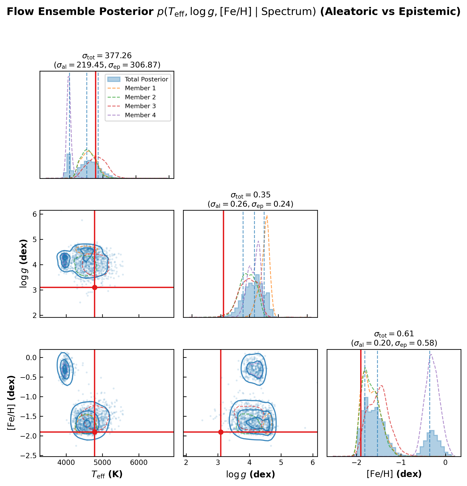

# Deep Ensemble of Normalizing Flows for Spectroscopy

> ← [Deep Ensembling](stellar_spectra_ensemble.md) | [Main Examples Index](index.md) →

This example demonstrates how to combine **Deep Ensembles** with **Conditional Normalizing Flows (NSF)** in `torchregress` to simultaneously capture non-Gaussian aleatoric noise and epistemic model uncertainty for 1D stellar spectra parameter estimation ($T_{\mathrm{eff}}$, $\log g$, $[\mathrm{Fe/H}]$).

---

## 1. Why Ensembles of Normalizing Flows?

Single normalizing flow models capture non-Gaussian aleatoric shapes (e.g. banana-shaped $T_{\mathrm{eff}}$ vs. $\log g$ degeneracies), but cannot quantify model uncertainty.

By ensembling $M$ distinct normalizing flow models $p_1, \dots, p_M$:
- **Aleatoric Uncertainty ($\sigma_{\text{al}}$)**: Internal spread / variance of individual conditional flow distributions.
- **Epistemic Uncertainty ($\sigma_{\text{ep}}$)**: Disagreement between predicted means across ensemble flow members.
- **Total Uncertainty ($\sigma_{\text{tot}}$)**: Mixture distribution $p_{\text{ensemble}}(\boldsymbol\theta \mid \mathbf{x}) = \frac{1}{M} \sum_{m=1}^M p_m(\boldsymbol\theta \mid \mathbf{x})$.

---

## 2. Architecture & Formulation

Given 1D spectrum $\mathbf{x} \in \mathbb{R}^{1000}$ and target parameters $\mathbf{y} \in \mathbb{R}^3$:

$$\mathbf{x} \xrightarrow{\text{CNN Member } m} \mathbf{c}_m(\mathbf{x}) \in \mathbb{R}^{32} \xrightarrow{\text{NSF Flow Head } \mathbf{f}_{\phi_m}(\mathbf{y}; \mathbf{c}_m)} \mathbf{z} \sim \mathcal{N}(\mathbf{0}, \mathbf{I}_3)$$

The total predictive posterior is formed by sampling $N/M$ draws from each member flow head:

$$\mathbf{y}^{(s)} \sim \frac{1}{M} \sum_{m=1}^M p_m(\mathbf{y} \mid \mathbf{x})$$

$$\sigma_{\text{tot}}^2 = \sigma_{\text{al}}^2 + \sigma_{\text{ep}}^2$$

---

## 3. Code Implementation

```python
import torch
import torch.nn as nn
from torchregress.ensemble import BaseEnsembleModel
from torchregress.losses.nflows import NormalizingFlowLoss, create_flow_model
from torchregress.viz import plot_corner_plot

# 1. Define Flow Ensemble Member Module
class FlowEnsembleMember(nn.Module):
    def __init__(self, input_len=1000, n_targets=3, context_dim=32):
        super().__init__()
        self.backbone = SpectrumCNNBackbone(input_len=input_len, context_dim=context_dim)
        self.flow = create_flow_model(
            n_features=n_targets,
            context_dim=context_dim,
            flow_type="nsf",
            n_transforms=3,
            hidden_features=[64, 64]
        )
        self.loss_wrapper = NormalizingFlowLoss(flow=self.flow, reduction="mean")

    def forward(self, x, y):
        ctx = self.backbone(x)
        return self.loss_wrapper(ctx, y)

    def sample_posterior(self, x, n_samples=1000):
        ctx = self.backbone(x)
        return self.loss_wrapper.sample(ctx, n_samples=n_samples).squeeze(0)

# 2. Instantiate Deep Ensemble of 4 Flow Models
base_member = FlowEnsembleMember(input_len=1000, n_targets=3, context_dim=32)
ensemble = BaseEnsembleModel(base_model=base_member, ensemble_size=4)

# 3. Train Each Member Flow
for member in ensemble.models:
    optimizer = torch.optim.AdamW(member.parameters(), lr=1e-3, weight_decay=1e-4)
    for spec_b, target_b in loader:
        optimizer.zero_grad()
        loss = member(spec_b, target_b)
        loss.backward()
        optimizer.step()

# 4. Render Corner Plot with Aleatoric + Epistemic Decomposition
plot_corner_plot(
    samples=total_ensemble_draws,
    member_samples=member_draws_unnorm,
    true_vals=true_stellar_params,
    param_names=[r"$T_{\mathrm{eff}}$ (K)", r"$\log g$ (dex)", r"$[\mathrm{Fe/H}]$ (dex)"],
    show_uncertainty_decomposition=True,
    title=r"Flow Ensemble Posterior $p(T_{\mathrm{eff}}, \log g, [\mathrm{Fe/H}] \mid \mathrm{Spectrum})$",
    save_path="figures/stellar_spectra_ensemble_flows.png"
)
```

---

## 4. Results & Corner Plot



---

## 5. Key Takeaways

1. **Non-Gaussian + Epistemic**: Combines Neural Spline Flows (capturing non-Gaussian aleatoric degeneracies) with Deep Ensembling (capturing epistemic model uncertainty).
2. **Explicit Visual Decomposition**: Displays member flow contours alongside the total mixture posterior.
3. **Publication-Ready Titles**: Annotates $\sigma_{\text{tot}} = \sqrt{\sigma_{\text{al}}^2 + \sigma_{\text{ep}}^2}$ above each 1D marginal.
