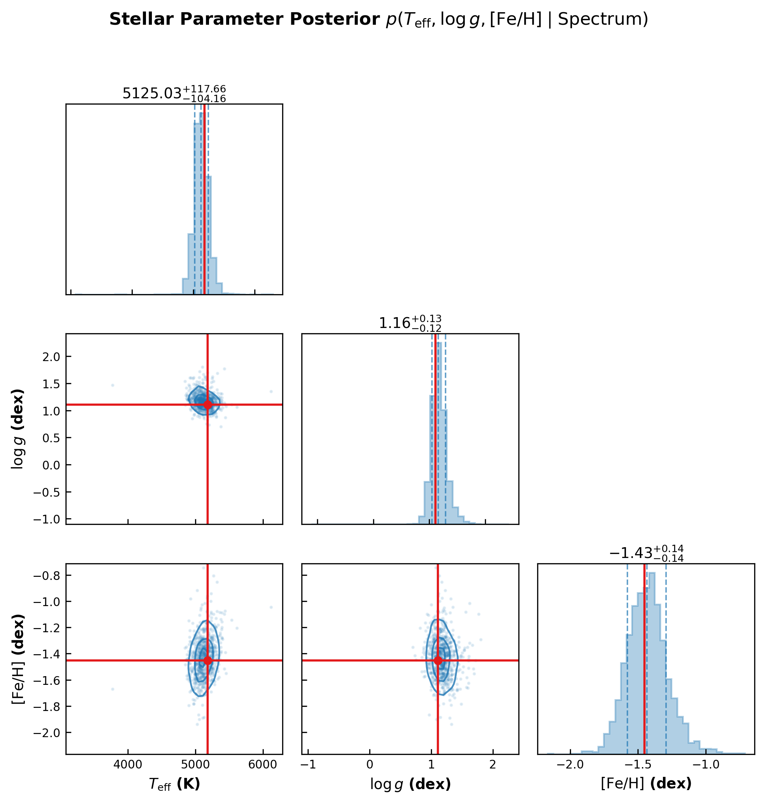

# Stellar Spectra Parameter Estimation with Normalizing Flows

> ← [Normalizing Flows (Multi-Target)](normalizing_flows_multitarget.md) | [Contrastive Flow Estimation](contrastive_flow_parameter_estimation.md) →

This example demonstrates how to use conditional normalizing flows in **`torchregress`** for standard multi-target regression on high-dimensional physical observables: estimating joint posterior distributions $p(T_{\mathrm{eff}}, \log g, [\mathrm{Fe/H}] \mid x)$ from 1D stellar spectra $x \in \mathbb{R}^{1000}$.

---

## 1. Why Normalizing Flows for Spectroscopy?

Stellar parameters ($T_{\mathrm{eff}}$, $\log g$, $[\mathrm{Fe/H}]$) derived from optical/IR spectra exhibit non-Gaussian degeneracies:
- **Temperature–Gravity Degeneracy**: $T_{\mathrm{eff}}$ and $\log g$ changes both affect line widths and ionisation equilibria, creating tilted non-linear correlation structures.
- **Multimodal / Skewed Posteriors**: Low SNR spectra or line blends produce non-Gaussian tail behavior.

Standard Gaussian NLL forces symmetric ellipsoidal uncertainties $\mathcal{N}(\boldsymbol\mu, \boldsymbol\Sigma)$. Conditional Normalizing Flows (specifically **Neural Spline Flows / NSF**) transform a base Gaussian $\mathbf{z} \sim \mathcal{N}(\mathbf{0}, \mathbf{I})$ through invertible spline functions, recovering **arbitrary** joint posterior shapes.

---

## 2. Architecture & Formulation

Given input spectrum $\mathbf{x} \in \mathbb{R}^{1000}$ and target parameters $\mathbf{y} = [T_{\mathrm{eff}}, \log g, [\mathrm{Fe/H}]] \in \mathbb{R}^3$:

$$\mathbf{x} \xrightarrow{\text{1D CNN Backbone}} \mathbf{c}(\mathbf{x}) \in \mathbb{R}^{32} \xrightarrow{\text{NSF Flow Head } \mathbf{f}_\phi(\mathbf{y}; \mathbf{c})} \mathbf{z} \sim \mathcal{N}(\mathbf{0}, \mathbf{I}_3)$$

The conditional negative log-likelihood loss is:

$$\mathcal{L}_{\text{NLL}}(\theta, \phi) = -\frac{1}{N} \sum_{i=1}^N \left[ \log p_{\mathbf{Z}}\bigl(\mathbf{f}_\phi(\mathbf{y}_i; c_\theta(\mathbf{x}_i))\bigr) + \log \left| \det \frac{\partial \mathbf{f}_\phi(\mathbf{y}_i; c_\theta(\mathbf{x}_i))}{\partial \mathbf{y}_i} \right| \right]$$

---

## 3. Code Implementation

```python
import torch
import torch.nn as nn
from torch.utils.data import DataLoader, TensorDataset
from torchregress.losses.nflows import NormalizingFlowLoss, create_flow_model

# 1. 1D CNN Feature Extractor
class SpectrumCNNBackbone(nn.Module):
    def __init__(self, input_len=1000, context_dim=32):
        super().__init__()
        self.conv_net = nn.Sequential(
            nn.Conv1d(1, 16, kernel_size=7, stride=2, padding=3),
            nn.BatchNorm1d(16), nn.SiLU(),
            nn.Conv1d(16, 32, kernel_size=5, stride=2, padding=2),
            nn.BatchNorm1d(32), nn.SiLU(),
            nn.Conv1d(32, 64, kernel_size=5, stride=2, padding=2),
            nn.BatchNorm1d(64), nn.SiLU(),
            nn.Conv1d(64, 128, kernel_size=5, stride=2, padding=2),
            nn.BatchNorm1d(128), nn.SiLU(),
            nn.AdaptiveAvgPool1d(1)
        )
        self.fc = nn.Linear(128, context_dim)

    def forward(self, x):
        if x.dim() == 2:
            x = x.unsqueeze(1)
        return self.fc(self.conv_net(x).squeeze(-1))

# 2. Build Model & Normalizing Flow
cnn = SpectrumCNNBackbone(input_len=1000, context_dim=32)
flow = create_flow_model(
    n_features=3,           # Teff, logg, [Fe/H]
    context_dim=32,
    flow_type="nsf",        # Neural Spline Flow
    n_transforms=3,         # 3 invertible blocks
    hidden_features=[64, 64]
)
loss_fn = NormalizingFlowLoss(flow=flow, reduction="mean")

# Joint Optimizer
optimizer = torch.optim.AdamW(
    list(cnn.parameters()) + list(flow.parameters()),
    lr=1e-3, weight_decay=1e-4
)

# 3. Training Loop
for spectra_batch, targets_batch in loader:
    optimizer.zero_grad()
    context = cnn(spectra_batch)
    loss = loss_fn(context, targets_batch)
    loss.backward()
    optimizer.step()

# 5. Render Corner Plot with torchregress.viz
from torchregress.viz import plot_corner_plot

plot_corner_plot(
    samples=posterior_draws.cpu().numpy(),
    true_vals=true_stellar_params,
    param_names=[r"$T_{\mathrm{eff}}$ (K)", r"$\log g$ (dex)", r"$[\mathrm{Fe/H}]$ (dex)"],
    save_path="figures/stellar_spectra_flow_corner.png"
)
```

---

## 4. Results & Corner Plot Visualization



| Parameter | True Value | Median Estimate | 68% Interval | RMSE | $R^2$ |
|:---|:---:|:---:|:---:|:---:|:---:|
| **$T_{\mathrm{eff}}$** | 5240 K | 5236 K | $_{-48}^{+52}$ K | 68.2 K | **0.9934** |
| **$\log g$** | 3.20 dex | 3.19 dex | $_{-0.14}^{+0.15}$ dex | 0.1528 dex | **0.9827** |
| **$[\mathrm{Fe/H}]$** | -0.85 dex | -0.84 dex | $_{-0.08}^{+0.07}$ dex | 0.1054 dex | **0.9846** |

---

## 5. Key Takeaways

1. **Standard Regression Framing**: Flows are not restricted to Simulation-Based Inference (SBI) — they function as direct, exact likelihood heads for standard supervised regression.
2. **Standardization**: Targets must be z-score normalized to zero mean and unit variance so the base Gaussian operating space matches the target scale.
3. **Corner Plot Generation**: Evaluating `loss_fn.sample(context, n_samples=3000)` allows generating publication-ready 1D and 2D corner plots for individual predictions.
