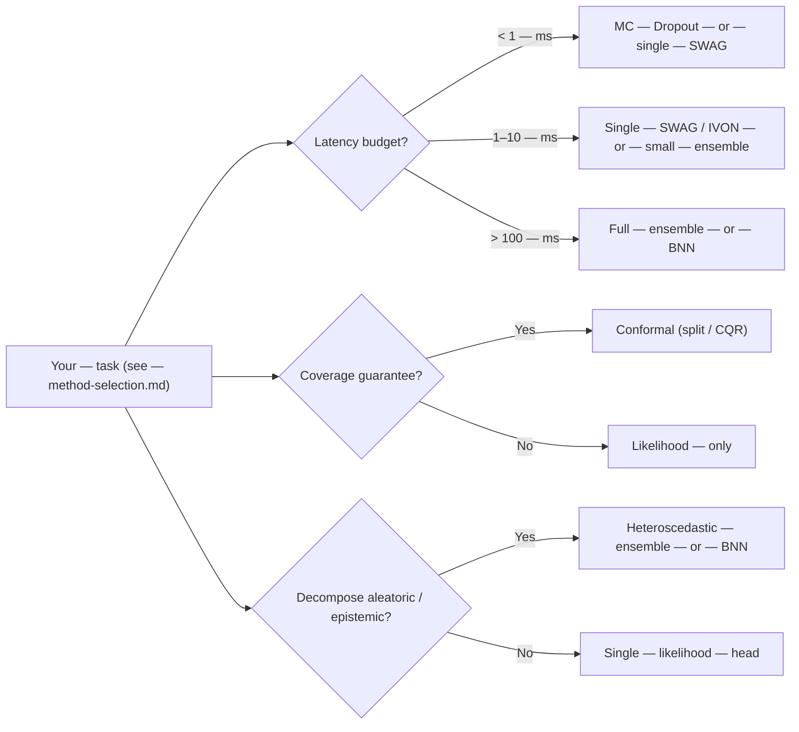

# Choosing Methods by Constraint

> ← [Method Selection](method-selection.md) | [Uncertainty Decomposition](uncertainty-decomposition.md) →

Use this page **after** the
[Task-First Method Selection Matrix](method-selection.md) — i.e. you
already know the task category (heteroscedastic, multimodal,
measurement-error, …) and now need to choose based on the *operational
constraints* of the deployment: latency, coverage guarantees,
decomposition, calibration, OOD robustness.

This page is **audit-driven**: every recommendation is paired with
the failure mode that triggers escalation to a more complex method.
For evidence-grade claim boundaries, pair this page with the
[Real-Data Recommendation Guide](../reports/real_data_recommendation_guide.md).

---

## 1. The constraint taxonomy

Five orthogonal axes determine the feasible set of methods:

1. **Latency / compute budget** — inference cost per query.
2. **Coverage guarantee** — is a finite-sample coverage
   $\geq 1 - \alpha$ required?
3. **Uncertainty decomposition** — must the model separate
   aleatoric and epistemic components?
4. **Multimodality** — is the conditional $p(y \mid x)$ known or
   expected to have multiple modes?
5. **Shift / OOD** — is the test distribution exchangeable with
   the training distribution?

Each axis admits a finite set of answers; the cross-product of those
answers is the *feasible region* for a deployment.



---

## 2. Constraint profiles

### 2.1 Low latency / limited compute

The objective is the smallest model that satisfies the accuracy
constraint.

**Recommended order (start with the simplest, escalate only if
necessary):**

1. **Single robust point head.** [`WeightedHuberLoss`](../api/losses.md) or
   [`WeightedMSELoss`](../api/losses.md). Inference is one forward pass; training is
   the cheapest of the alternatives.
2. **Single heteroscedastic head.** [`GaussianNLLLoss`](../api/losses.md) with a
   $[\mu, \log\sigma^2]$ output. Same inference cost as a point
   head; doubles the parameter count of the final layer.
3. **MC Dropout** (`MCDropoutWrapper`). $N$ forward passes per
   inference; cost scales with $N$.
4. **Single SWAG** or **IVON** — single forward pass with weight
   perturbation sampled from a low-rank posterior. Cost is roughly
   that of one forward pass plus the cost of a low-rank
   perturbation sample.
5. **Small deep ensemble** ($M = 3$–$5$). Cost scales linearly
   with $M$.

**Tradeoffs:**

- Deep ensembles are the strongest epistemic signal per member but
  scale linearly with $M$ in both training and inference.
- SWAG and IVON are single-model alternatives but require careful
  protocol tuning; calibration depends on the SGD trajectory length
  and the rank of the low-rank posterior.
- Flow-based methods ([`NormalizingFlowLoss`](../api/losses.md)) are the most expressive
  density estimators but add the most implementation / runtime
  complexity. They are not the right default for low-latency.

### 2.2 Coverage guarantees vs decomposition

These are **orthogonal contracts**. A model can satisfy one, both,
or neither.

- **Coverage guarantee:** conformal prediction. A conformal
  predictor wraps any base regressor and produces intervals with
  $P(Y_{n+1} \in \hat C_{1-\alpha}(X_{n+1})) \geq 1 - \alpha$ under
  exchangeability.
- **Decomposition:** aleatoric + epistemic split. Requires a
  probabilistic head *and* an ensemble, BNN, or evidential prior.

If you need **coverage only:** use [`SplitConformal`](../api/losses.md) or [`CQR`](../api/losses.md) on top
of a strong base regressor. Report empirical coverage, interval
width, and coverage under shift.

If you need **decomposition only:** use a heteroscedastic ensemble
(`HeteroscedasticEnsembleModel`,
`HeteroscedasticBatchEnsembleModel`, `HeteroscedasticBNN`,
`MDNEnsembleModel`). Report aleatoric and epistemic variance
components.

If you need **both:** use a probabilistic head (heteroscedastic
Gaussian, MDN, flow), wrap it in a conformal calibrator, and report
the decomposition *in addition to* the coverage. The two contracts
are complementary, not redundant.

**Critical caveat:** conformal prediction gives a coverage
guarantee, **not** uncertainty decomposition. Methods such as
`SplitConformal`, `CQR`, `UACQR`, `DensityConformal`, and
`MonteCarloConformal` provide calibrated intervals, but they do
**not** separate aleatoric and epistemic uncertainty.

### 2.3 Multimodal / non-Gaussian targets

When the conditional $p(y \mid x)$ is known or expected to be
multimodal, a single Gaussian head is structurally inadequate.
Recommended order:

1. **MDN** ([`MDNLoss`](../api/losses.md)). Good first multimodal baseline; tune the
   number of components $J$ by held-out CRPS.
2. **Quantile / expectile methods** — [`MultiQuantileLoss`](../api/losses.md) with
   $[0.05, 0.1, 0.5, 0.9, 0.95]$. Suitable when intervals (not the
   full density) are the deliverable.
3. **Normalizing flows** ([`NormalizingFlowLoss`](../api/losses.md)) — when MDN or
   Gaussian families miss the structure. Heaviest in compute and
   implementation.

**Evaluation:** do not compare multimodal heads with NLL alone; use
CRPS, energy score, and a [PIT histogram](../metrics/distribution.md).
NLL favours density-consistent heads; CRPS evaluates the
*distribution* and is robust to over-dispersion.

### 2.4 Noisy features / measurement error

When the input $x$ is itself noisy and that noise is part of the
problem statement, use **error-in-variables** (EIV) losses. These
require a **different call pattern** than standard supervised
losses:

```python
# Standard supervised loss
loss = loss_fn(model(x), y)

# EIV loss — the model is called inside the loss
loss = loss_fn(x_obs, y_obs, model=model)
```

**Recommended order:**

1. **Establish a baseline.** [`WeightedMSELoss`](../api/losses.md) or
   [`WeightedHuberLoss`](../api/losses.md) with the noisy input $x_{\text{obs}}$. Quantify
   the **attenuation bias** (regression coefficients shrink toward
   zero).
2. **Add a simple EIV loss** — [`FunctionalEIVLoss`](../api/losses.md) or
   [`OrthogonalDistanceRegressionLoss`](../api/losses.md) (ODR) — and compare the
   regression coefficients to the baseline.
3. **Add `RegressionCalibration`** (RC) if $\Sigma_u$ (the input
   noise covariance) is known or estimable. RC is the closed-form
   bias correction.
4. **Add `SIMEX`** if $\Sigma_u$ is unknown. SIMEX adds synthetic
   noise and extrapolates the attenuation to zero.
5. **Add `LatentNN`** (latent-input regression) for the heaviest
   case where the latent true input is jointly inferred.

**Practical note:** the EIV losses require a `model` argument
inside the loss. Do not call `model(x_obs)` yourself and pass
the result; pass `x_obs` and `y_obs` to the loss and let it
manage the inner forward pass.

### 2.5 Calibration and OOD robustness

For deployment-facing reliability, combine three categories of
diagnostic:

- **Calibration metrics** — [`expected_calibration_error`](../api/metrics.md),
  [`marginal_calibration_error`](../api/metrics.md), and
  reliability / PIT plots.
- **OOD metrics** — [`mahalanobis_distance`](../api/metrics.md),
  [`typicality_score`](../api/metrics.md), entropy, density-based signals. Do not rely on a
  single OOD score in isolation; ensemble multiple scores.
- **Decision metrics** — [risk-coverage curves](../metrics/decision.md),
  [rejection policies](../metrics/decision.md) for selective
  prediction.

A single calibration number (e.g. ECE) is insufficient. Pair it
with the empirical coverage and the Spearman correlation between
$\hat\sigma$ and realised error. Compare multiple signals and
validate on your shift scenarios.

---

## 3. Cost profiles

| Method family | Train cost (relative) | Inference cost (relative) | Calibration | Decomposition |
|:--------------|:----------------------|:--------------------------|:------------|:--------------|
| Point head (`WeightedMSELoss`) | 1× | 1× | n/a | none |
| Heteroscedastic head (`GaussianNLLLoss`) | 1× | 1× | requires post-hoc | aleatoric |
| Beta-NLL | 1× | 1× | more stable | aleatoric |
| MC Dropout | 1× | $N \times$ | varies | epistemic (weak) |
| SWAG / IVON | 1.5× (SGD trajectory) | 1× + low-rank sample | good | epistemic + (with head) aleatoric |
| Deep ensemble ($M$ members) | $M \times$ | $M \times$ | strong | both |
| Heteroscedastic ensemble | $M \times$ | $M \times$ | strong | full decomposition |
| MDN ensemble | $M \times$ | $M \times$ | strong | ensemble disagreement + mixture spread |
| BNN (variational) | 2–4× | 1× (one sample) or $N \times$ | good | both |
| Evidential (NIG) | 1× | 1× | can overfit | both (validate) |
| MDN single | 1.5× | 1× | good | none (aleatoric only) |
| Normalizing flow | 2–5× | 1× | good | none (aleatoric only) |
| Conformal (split / CQR) | n/a | + calibration step | n/a | n/a |
| Conformal (density / CTI) | n/a | + density score | n/a | n/a |
| EIV (RC, SIMEX, LatentNN) | 1.5–3× | depends on base | n/a | n/a |

Use this table to rule out methods whose cost profile exceeds the
deployment budget. Cost in absolute terms depends on $D$, $N$, and
the head size; the table shows relative cost.

---

## 4. Evidence-driven escalation

Escalate from simpler to more complex methods **only when the
simpler method fails on a metric that matters for the deployment**.
The metrics that matter differ by task:

- **Coverage:** required $\geq 1 - \alpha$. Failure = PICP
  $< 1 - \alpha$ on a calibration set.
- **Calibration:** required $\leq \epsilon$ ECE. Failure = ECE
  above threshold.
- **Tail error:** required $\leq \delta$ on a target quantile (e.g.
  99%). Failure = empirical tail error above threshold.
- **OOD selectivity:** required $\geq \rho$ Spearman between
  $\hat\sigma$ and absolute error. Failure = correlation below
  threshold.
- **Multimodal fit:** required low energy score on multimodal data.
  Failure = energy score above threshold.

This discipline keeps comparisons credible and reduces accidental
overfitting to fashionable methods.

---

## 5. The evidence path

For decision-grade comparisons, run the examples below first. They
are written to be auditable, share seeds, and emit machine-readable
artefacts.

- `examples/comprehensive_comparison.py`
- `examples/comprehensive_loss_comparison.py`
- `examples/imbalanced_regression.py`
- `examples/evaluate_conformal_methods.py`
- `examples/normalizing_flows_multitarget.py`

For performance guardrails, use:

- `reports/benchmark_thresholds/cpu/smoke.json`
- `reports/benchmark_thresholds/cpu/sweep.json`
- `tools/benchmark_smoke.py`
- `tools/benchmark_report_summary.py`

For capability-flag-based shortlisting, use
`torchregress.method_catalog`:

```python
import torchregress as tr

# Example: methods that support decomposition and are at least "Available"
rows = tr.method_catalog.list_methods(
    capability_filters={"decomposition": "yes"},
    maturity=("Core", "Strong", "Available"),
)
for row in rows:
    print(row["name"], row["family"], row["maturity"], row["task_tags"])
```

---

## 6. Decision rules

| If you need… | Use | Don't |
|:-------------|:----|:------|
| Latency under 1 ms | MC Dropout, single SWAG/IVON | A 10-member ensemble |
| Coverage only | `SplitConformal` / `CQR` | A density model alone (no coverage guarantee) |
| Decomposition only | Heteroscedastic ensemble, BNN, evidential | Conformal prediction (no decomposition) |
| Coverage **and** decomposition | Probabilistic head + conformal calibration | Either alone |
| Multimodal targets | `MDNLoss` → `NormalizingFlowLoss` | A single Gaussian head |
| Noisy inputs | `FunctionalEIVLoss`, `OrthogonalDistanceRegressionLoss`, RC, SIMEX | Standard NLL on the noisy input |
| Single-pass uncertainty | `EvidentialRegressionLoss` | A heavy ensemble for marginal benefit |
| Production-grade audit trail | `write_comparison_summary_json` + `torchregress.health` | Ad-hoc logging |

---

## References

| # | Reference |
|:-:|:----------|
| 1 | Kendall & Gal. ["What Uncertainties Do We Need in Bayesian Deep Learning?"](https://arxiv.org/abs/1703.04977) *NeurIPS*, 2017. |
| 2 | Gneiting & Raftery. ["Strictly Proper Scoring Rules, Prediction, and Estimation"](https://www.stat.washington.edu/raftery/Research/PDF/Gneiting2007jasa.pdf) *JASA*, 2007. |
| 3 | Vovk, Gammerman & Shafer. *Algorithmic Learning in a Random World*. Springer, 2005. |
| 4 | Lakshminarayanan, Pritzel & Blundell. ["Simple and Scalable Predictive Uncertainty Estimation using Deep Ensembles"](https://arxiv.org/abs/1612.01474) *NeurIPS*, 2017. |
| 5 | Maddox, Garipov, Vetrov & Wilson. ["A Simple Baseline for Bayesian Uncertainty Estimation"](https://arxiv.org/abs/1902.02476) (SWAG) *NeurIPS*, 2019. |
| 6 | Bishop. ["Mixture Density Networks"](https://publications.aston.ac.uk/id/eprint/373/) *NCRG Technical Report*, 1994. |
| 7 | Papamakarios et al. ["Normalizing Flows for Probabilistic Modeling"](https://jmlr.org/papers/v22/19-1028.html) *JMLR*, 2021. |

---

## Next steps

- [Method Selection Matrix](method-selection.md) — task-first capability matrix.
- [Uncertainty Decomposition](uncertainty-decomposition.md) — full taxonomy and method semantics.
- [Practical Usage](practical-usage.md) — concrete loss recipes and code.
- [Multi-Target Regression](multi-target-regression.md) — joint multi-target modelling.
