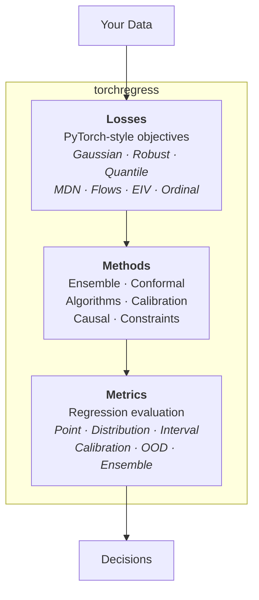

# torchregress

<p align="center">
    <em>Deep Learning for Regression & Uncertainty Estimation in PyTorch</em>
</p>

<p align="center">
<a href="https://github.com/sfabbro/torchregress/actions/workflows/ci.yml" target="_blank">
    
</a>
<a href="https://pypi.org/project/torchregress" target="_blank">
    
</a>
<a href="https://pypi.org/project/torchregress" target="_blank">
    
</a>
<a href="https://opensource.org/licenses/MIT" target="_blank">
    
</a>
</p>

---

**torchregress** is a comprehensive PyTorch library for researchers and practitioners working on complex regression problems. It goes beyond standard Mean Squared Error, providing a unified toolkit for **probabilistic modeling**, **uncertainty quantification**, and **robust estimation**.

---

## Architecture



---

## Key Capabilities

<div class="grid cards" markdown>

-   :material-chart-bell-curve-cumulative: __Probabilistic Losses__

    PyTorch-style loss functions from weighted MSE to normalizing flows.

    [:octicons-arrow-right-24: Losses Catalogue](losses/index.md)

-   :material-shield-check: __Uncertainty Quantification__

    Deep Ensembles, SWAG, Conformal Prediction, Evidential Regression.

    [:octicons-arrow-right-24: Methods](methods/index.md)

-   :material-flask-outline: __Robust Estimation__

    M-estimators, EIV correction, noisy-label mitigation, imbalance handling.

    [:octicons-arrow-right-24: Robust Losses](losses/robust.md)

-   :material-chart-line: __Rigorous Evaluation__

    Proper scoring rules, calibration curves, OOD detection, interval metrics.

    [:octicons-arrow-right-24: Metrics](metrics/index.md)

</div>

---

## Installation

```bash
pip install torchregress
```

*Requires PyTorch 2.4+ and Python 3.12 to <3.16.*

---

## Quick Example

Train a model that predicts both the **mean** ($\mu$) and **uncertainty** ($\sigma^2$):

```python
import torch
import torch.nn as nn
from torchregress.losses import GaussianNLLLoss

# 1. Model with two outputs (mean and log-variance)
model = nn.Sequential(nn.Linear(10, 64), nn.ReLU(), nn.Linear(64, 2))

# 2. Specialized Gaussian NLL loss
loss_fn = GaussianNLLLoss()

# 3. Standard PyTorch training loop
optimizer = torch.optim.Adam(model.parameters(), lr=1e-3)
for x, y in dataloader:
    pred = model(x)  # [batch, 2]
    loss = loss_fn(pred, y)
    loss.backward(); optimizer.step(); optimizer.zero_grad()
```

[:octicons-arrow-right-24: Full Quick Start](getting-started/quickstart.md)

---

## Start Here

<div class="grid cards" markdown>

-   __New to Uncertainty?__
    -   Read the [Core Concepts](getting-started/concepts.md)
    -   Follow the [Quick Start](getting-started/quickstart.md)
    -   Try the [Basic Usage Tutorial](examples/basic_usage.md)

-   __Experienced Practitioner__
    -   Use the [Method Selection Matrix](guide/method-selection.md)
    -   Explore [Losses](losses/index.md) and [Methods](methods/index.md)
    -   Run the [Comparison Examples](examples/index.md)

-   __Researcher / Statistician__
    -   Study the [Mathematical Foundations](guide/math/index.md)
    -   Check the [Reports & Evidence](reports/index.md)
    -   Browse the [API Reference](api/index.md)

</div>

---

## Citation

If you use torchregress in your research, please cite:

```bibtex
@software{torchregress,
  title = {{torchregress: A PyTorch Library for Regression and Uncertainty Estimation}},
  author = {Fabbro, Sébastien},
  url = {https://github.com/sfabbro/torchregress},
  version = {0.1.0},
  year = {2024},
}
```
