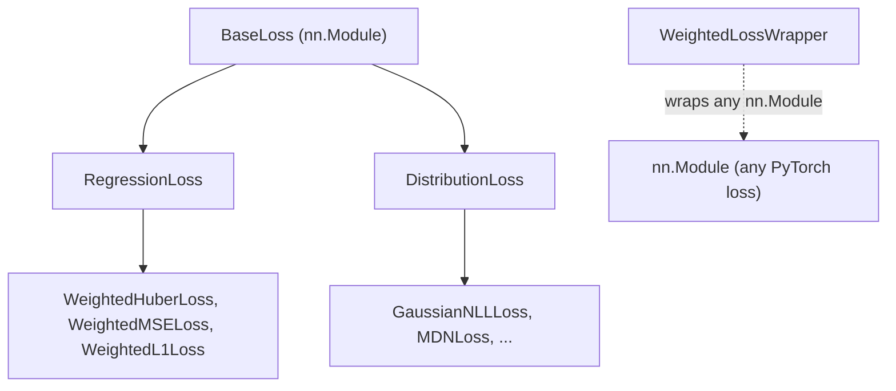

# Base Loss Classes

The foundation of all torchregress loss functions — providing **unified masking**, **sample weighting**, and **consistent reduction** semantics.

---

## Class Hierarchy



| Base Class | Purpose | Model Output |
|:-----------|:--------|:-------------|
| [`RegressionLoss`](../api/losses.md) | Point-prediction losses | $\hat{y}$ |
| [`DistributionLoss`](../api/losses.md) | Distributional losses (NLL) | $(\mu, \log\sigma^2)$ or distribution params |
| [`WeightedLossWrapper`](../api/losses.md) | Adapts any PyTorch loss | Same as wrapped loss |

---

## BaseLoss

Root class extending `nn.Module` (see [BaseLoss API](../api/losses.md)). All subclasses inherit:

- `reduction`: `"mean"` (default), `"sum"`, or `"none"`
- `_reduce(loss, mask, weights)`: applies reduction with masking and weighting

```python
class CustomLoss(BaseLoss):
    def forward(self, y_pred, y_true, mask=None, weights=None, **kwargs):
        loss = (y_pred - y_true) ** 2
        return self._reduce(loss, mask, weights)
```

---

## RegressionLoss

For losses that operate on **point predictions** $\hat{y}$ (see [RegressionLoss API](../api/losses.md)):

```python
from torchregress.losses import WeightedMSELoss, WeightedL1Loss, WeightedHuberLoss

loss_fn = WeightedMSELoss()
loss = loss_fn(y_pred, y_true, mask=valid_mask, weights=sample_weights)
```

All `RegressionLoss` subclasses accept:

| Argument | Type | Description |
|:---------|:-----|:------------|
| `y_pred` | `Tensor` | Model predictions |
| `y_true` / `target` | `Tensor` | Ground truth |
| `mask` | `Tensor` (bool) | Valid-sample mask |
| `weights` | `Tensor` | Per-sample importance weights |

---

## DistributionLoss

For losses that model **full probability distributions** (see [DistributionLoss API](../api/losses.md)):

```python
from torchregress.losses import GaussianNLLLoss

loss_fn = GaussianNLLLoss()

# Model outputs (mean, log_var) — either as tuple or concatenated
mean = torch.randn(64, 1)
log_var = torch.randn(64, 1)
loss = loss_fn((mean, log_var), y_true)
```

> For the full API contract, see [GaussianNLLLoss API](../api/losses.md).

Key methods:

| Method | Description |
|:-------|:------------|
| `_extract_distribution_parameters(y_pred)` | Split model output into distribution params |
| `_calculate_nll(y_pred, y_true, mask)` | Compute negative log-likelihood |

---

## WeightedLossWrapper

Adapts **any PyTorch loss** to the torchregress interface (mask + weights support):

```python
from torchregress.losses import WeightedLossWrapper
import torch.nn as nn

# Wrap standard PyTorch loss
wrapped = WeightedLossWrapper(nn.MSELoss)
loss = wrapped(y_pred, y_true, mask=mask, weights=weights)
```

### Pre-Defined Weighted Losses

| torchregress | Wraps |
|:-------------|:------|
| `WeightedMSELoss` | `nn.MSELoss` |
| `WeightedL1Loss` | `nn.L1Loss` |
| `WeightedHuberLoss` | `nn.HuberLoss` |
| `GaussianNLLLoss` | `nn.GaussianNLLLoss` |
| `WeightedCrossEntropyLoss` | `nn.CrossEntropyLoss` |
| `WeightedNLLLoss` | `nn.NLLLoss` |

---

## Implementing Custom Losses

```python
import torch
from torchregress.losses.base import RegressionLoss

class AsymmetricLoss(RegressionLoss):
    """Penalise under-prediction more than over-prediction."""

    def __init__(self, alpha=0.7, reduction="mean"):
        super().__init__(reduction=reduction)
        self.alpha = alpha

    def forward(self, y_pred, y_true, mask=None, weights=None, **kwargs):
        error = y_true - y_pred
        loss = torch.where(
            error > 0,
            self.alpha * error ** 2,        # under-prediction
            (1 - self.alpha) * error ** 2,   # over-prediction
        )
        return self._reduce(loss, mask, weights)
```

!!! tip "Best practices"
    1. Inherit from `RegressionLoss` (point) or `DistributionLoss` (distributional)
    2. Always call `self._reduce(loss, mask, weights)` — don't manually reduce
    3. Accept `**kwargs` in `forward` for compatibility with the loss registry
    4. Document the math in docstrings

---

## Next steps

- [Loss Functions index](index.md) — every loss family with formulas and use cases
- [Losses API reference](../api/losses.md) — complete symbol table with signatures
- [Method Selection Matrix](../guide/method-selection.md) — task-first guidance
