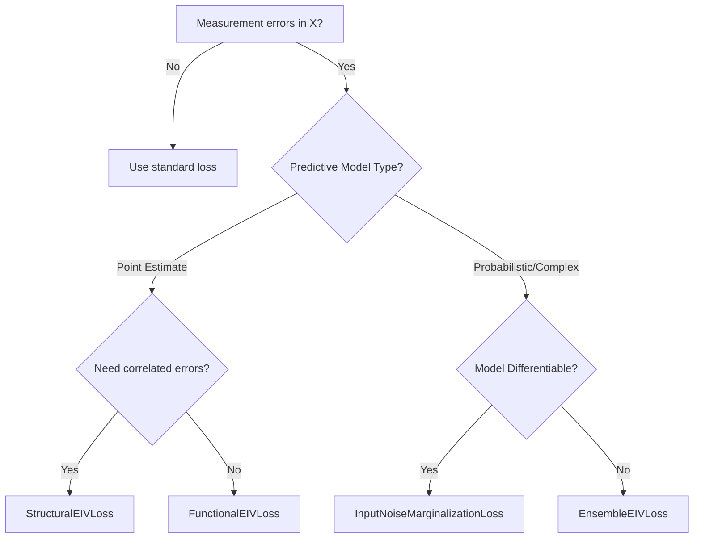

# Error-in-Variables (EIV) Losses

Standard regression assumes that **inputs $X$ are measured perfectly** — only the target $Y$ has noise.  In practice, this assumption is almost always violated: sensor readings have finite precision, proxy variables approximate the true quantity, and derived features carry propagated errors.  EIV losses address this by modelling the realistic case where **both** inputs and outputs are noisy:

$$X_{\text{obs}} = X^* + \varepsilon_X, \qquad Y_{\text{obs}} = f(X^*) + \varepsilon_Y$$

where $\varepsilon_X \sim \mathcal{N}(0, \Sigma_X)$ and $\varepsilon_Y \sim \mathcal{N}(0, \Sigma_Y)$ are independent additive Gaussian noise terms.

!!! abstract "Where this matters"
    - **Scientific measurement**: instrument readings with known per-sample noise, lab assays with reported precision
    - **Engineering**: sensor calibration with known tolerances, geolocation with GPS error
    - **Healthcare**: lab test results with assay precision, self-reported variables with recall error
    - **Remote sensing**: satellite-derived features with spatial/temporal averaging artefacts
    - **Economics**: survey responses with measurement error, imputed income from tax records

---

## Why Standard Regression Fails

When inputs are noisy with variance $\sigma_\varepsilon^2$, OLS produces systematically **biased** coefficient estimates:

$$\hat\beta_{\text{OLS}} \xrightarrow{p} \frac{\sigma_{X^*}^2}{\sigma_{X^*}^2 + \sigma_\varepsilon^2}\,\beta = \lambda\,\beta$$

where $\lambda \in (0, 1)$ is the **reliability ratio**.  This is known as **attenuation bias** — slopes are underestimated, and the effect worsens with noisier inputs.

!!! warning "The danger of ignoring measurement error"
    With $\sigma_\varepsilon / \sigma_{X^*} = 1$ (signal-to-noise ratio of 1), OLS recovers only **half** the true slope.  This is not a small-sample problem — it persists with infinite data.

---

## Available Losses

| Loss | Approach | Key Feature | API |
|:-----|:---------|:------------|:----|
| `InputNoiseMarginalizationLoss` | MC sampling over input noise | **Recommended Default** for non-linear/probabilistic models | [Losses API](../api/losses.md) (EIV) |
| [`FunctionalEIVLoss`](../api/losses.md#functionaleivloss) | Taylor expansion of $f$ around $X_{\text{obs}}$ | Fast, gradient-based (Point estimates) | [`FunctionalEIVLoss`](../api/losses.md#functionaleivloss) |
| `InputNoiseMDNLoss` | MC marginalization for MDN heads | Handles multimodal targets with noisy inputs | [Losses API](../api/losses.md) (EIV) |
| `InputNoiseBinnedPDFLoss` | MC marginalization for classification/binning | Reliable uncertainty for binned PDF models | [Losses API](../api/losses.md) (EIV) |
| [`OrthogonalDistanceRegressionLoss`](../api/losses.md#orthogonaldistanceregressionloss) | Optimises latent $X^*$ per sample | Classical ODR, inner loop | [`OrthogonalDistanceRegressionLoss`](../api/losses.md#orthogonaldistanceregressionloss) |

---

### InputNoiseMarginalizationLoss

The **recommended starting point** for modern probabilistic models. Instead of relying on local Taylor expansions, it uses Monte Carlo sampling to approximate the marginal likelihood:

$$p(y|x_{\text{obs}}) = \int p(y|x) p(x|x_{\text{obs}}) dx \approx \frac{1}{N} \sum_{i=1}^N p(y|x_i)$$

where $x_i \sim \mathcal{N}(x_{\text{obs}}, \Sigma_X)$. This approach is extremely stable and works naturally with complex predictive heads like MDNs or Binned PDFs.

!!! warning "Critical API Difference"
    Unlike standard PyTorch loss functions which take predictions and targets, e.g., `loss_fn(y_pred, target)`, EIV loss functions must evaluate the model internally at perturbed inputs.
    - **Constructor**: You **must** pass your `model` reference to the loss constructor.
    - **Forward Call**: Pass the **observed inputs** $x_{\text{obs}}$ and **observed targets** $y_{\text{obs}}$ directly:
      `loss = loss_fn(x_obs, y_obs)`

!!! warning "Computational Cost of MC Marginalization"
    Monte Carlo marginalization requires $N_{\text{samples}}$ forward passes of the model for every training and evaluation step. If your model backbone is computationally expensive, this will multiply training time by $N_{\text{samples}}$.
    - **Mitigation**: Start with `n_samples=8` or `16` and `antithetic=True` (which generates **negatively correlated** paired samples to reduce variance) rather than a large $N$.

!!! warning "Model determinism during MC sampling"
    MC marginalization calls the model multiple times per input with different noise perturbations. **Dropout and BatchNorm must be in eval mode** during these forward passes — otherwise each MC sample sees a different stochastic dropout mask or batch statistic, injecting unintended variance that biases the marginal likelihood estimate. Use `model.eval()` or manually disable stochastic layers before wrapping with EIV losses.

!!! warning "FunctionalEIVLoss differentiability"
    The Taylor expansion used by `FunctionalEIVLoss` requires the model $f(x)$ to be **twice differentiable** with respect to inputs. Activation functions like `ReLU` have zero second derivatives, causing the curvature term $\partial^2 f / \partial x^2$ to vanish. Prefer smooth activations (`GELU`, `Tanh`, `SiLU`) when using `FunctionalEIVLoss`.

```python
from torchregress.losses import InputNoiseMarginalizationLoss, GaussianNLLLoss

loss_fn = InputNoiseMarginalizationLoss(
    model=my_model,
    base_loss=GaussianNLLLoss(), # Any standard regression loss
    sigma_x=0.2,                 # Input noise std
    n_samples=16,                # Number of MC samples
    antithetic=True,             # Use antithetic sampling for variance reduction
)
```

#### NoisyInputPredictor (Wrapper)

For easy test-time inference, use the high-level wrapper which automatically handles the marginalization logic:

```python
from torchregress.losses import NoisyInputPredictor

# Wrap your model
predictive = NoisyInputPredictor(model, sigma_x=0.2, n_samples=32)

# Normal forward pass now returns the marginalized mean prediction
y_pred_mean = predictive(x_obs)

# Get raw samples for ensemble/density estimation
y_samples = predictive.sample_predictions(x_obs)
```

---

### Multimodal EIV Variants

For complex predictive distributions (like scientific regression), use specialized marginalizers:

**InputNoiseMDNLoss**
Combines Input-Noise Marginalization with Mixture Density Networks.

```python
from torchregress.losses import InputNoiseMDNLoss

loss_fn = InputNoiseMDNLoss(
    model=my_mdn,
    n_components=5,
    sigma_x=0.1
)
```

**InputNoiseBinnedPDFLoss**
Marginalizes over inputs for models predicting discrete probability bins.

```python
from torchregress.losses import InputNoiseBinnedPDFLoss

loss_fn = InputNoiseBinnedPDFLoss(model=my_classifier, sigma_x=0.1)
```

---

### FunctionalEIVLoss

Propagates $X$-uncertainty through the model via a **first-order Taylor approximation**:

$$\text{Var}(Y) \approx \mathbf{J}\,\Sigma_X\,\mathbf{J}^\top + \Sigma_Y$$

where $\mathbf{J} = \partial f / \partial X$ is the Jacobian of shape $[n_{\text{out}} \times n_{\text{in}}]$. For scalar output this reduces to the inner product $\mathbf{J}\Sigma_X\mathbf{J}^\top = (\nabla_X f)^\top \Sigma_X (\nabla_X f)$.

```python
from torchregress.losses import FunctionalEIVLoss

loss_fn = FunctionalEIVLoss(
    model=my_model,
    sigma_x=torch.tensor([0.2, 0.1]),   # per-feature noise std
    sigma_y=0.1,
    monte_carlo=False,   # True → MC gradient estimation
    n_samples=20,        # MC samples (if monte_carlo=True)
)

loss = loss_fn(x_obs, y_obs)
```

| Parameter | Type | Default | Description |
|:----------|:-----|:--------|:------------|
| `model` | `Callable` | — | Differentiable model $f(x)$ |
| `sigma_x` | `float` or `Tensor` | — | Input noise std/covariance |
| `sigma_y` | `float` or `Tensor` | `None` | Target noise std/covariance |
| `monte_carlo` | `bool` | `False` | Use MC for gradient estimation |

### StructuralEIVLoss

Accounts for **correlations** between input and output errors via a cross-covariance matrix $\Sigma_{XY}$:

```python
from torchregress.losses import StructuralEIVLoss

loss_fn = StructuralEIVLoss(
    model=my_model,
    sigma_x=cov_x,    # [d_x, d_x]
    sigma_y=cov_y,    # [d_y, d_y]
    sigma_xy=cov_xy,  # [d_y, d_x] cross-covariance
)
```

### OrthogonalDistanceRegressionLoss

Minimises the **perpendicular distance** from observations to the model surface by jointly optimising latent true inputs $\hat{X}$:

$$\mathcal{L}_{\text{ODR}} = (X - \hat{X})^\top \Sigma_X^{-1} (X - \hat{X}) + (Y - f(\hat{X}))^\top \Sigma_Y^{-1} (Y - f(\hat{X}))$$

```python
from torchregress.losses import OrthogonalDistanceRegressionLoss

loss_fn = OrthogonalDistanceRegressionLoss(
    model=my_model,
    sigma_x=torch.tensor([1.0, 1.0]),
    sigma_y=torch.tensor([1.0]),
    learning_rate=0.01,     # inner optimisation LR
    max_iterations=10,      # inner loop steps
)
```

---

## Decision Guide



!!! tip "Scientific Data Recommendation"
    For scientific regression with non-linear feature/target relationships and reported input uncertainties, **InputNoiseMarginalizationLoss** with an MDN or BinnedPDF head is a highly effective approach, as it correctly handles the non-linear relationship between features and targets while accounting for measurement errors.

---

## Complete Example

```python
import torch
import torch.nn as nn
from torchregress.losses import InputNoiseMarginalizationLoss

# True relationship: y = 2x + 1
torch.manual_seed(42)
x_true = torch.linspace(0, 10, 200).unsqueeze(1)
y_true = 2.0 * x_true + 1.0

# Add measurement noise to BOTH x and y
x_obs = x_true + 0.5 * torch.randn_like(x_true)
y_obs = y_true + 0.3 * torch.randn_like(y_true)

# Model
model = nn.Sequential(nn.Linear(1, 32), nn.ReLU(), nn.Linear(32, 1))

from torchregress.losses import InputNoiseMarginalizationLoss, WeightedMSELoss

# EIV loss using marginalization (the modern default)
loss_fn = InputNoiseMarginalizationLoss(
    model=model,
    base_loss=WeightedMSELoss(),
    sigma_x=0.5,
)
optimizer = torch.optim.Adam(model.parameters(), lr=0.01)

for epoch in range(200):
    optimizer.zero_grad()
    loss = loss_fn(x_obs, y_obs)
    loss.backward()
    optimizer.step()
```

---

## Related

- [RC Algorithm](../methods/algorithms/rc.md) — Regression Calibration for EIV correction
- [SIMEX Algorithm](../methods/algorithms/simex.md) — Simulation-Extrapolation for measurement error

---

## References

| # | Reference |
|:-:|:----------|
| 1 | W.A. Fuller. *Measurement Error Models*. Wiley, **1987**. |
| 2 | R.J. Carroll et al. *Measurement Error in Nonlinear Models*. Chapman & Hall, 2nd ed., **2006**. |
| 3 | P.T. Boggs, J.E. Rogers. ["Orthogonal Distance Regression."](https://doi.org/10.1090/conm/112/1087090) *Contemporary Mathematics*, vol. 112, AMS, **1990**. |
| 4 | C.L. Cheng, J.W. Van Ness. *Statistical Regression with Measurement Error*. Arnold, **1999**. |
