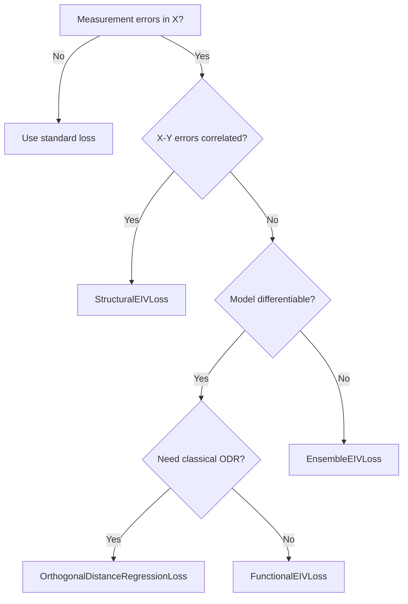

# Error-in-Variables (EIV) Losses

Standard regression assumes that **inputs $X$ are measured perfectly** — only the target $Y$ has noise.  In practice, this assumption is almost always violated: sensor readings have finite precision, proxy variables approximate the true quantity, and derived features carry propagated errors.  EIV losses address this by modelling the realistic case where **both** inputs and outputs are noisy:

$$X_{\text{obs}} = X^* + \varepsilon_X, \qquad Y_{\text{obs}} = f(X^*) + \varepsilon_Y$$

!!! abstract "Where this matters"
    - **Scientific measurement**: spectral features measured with instrument noise, photometric magnitudes with Poisson noise
    - **Engineering**: sensor calibration with known tolerances, geolocation with GPS error
    - **Healthcare**: lab test results with assay precision, self-reported variables with recall error
    - **Remote sensing**: satellite-derived features with spatial/temporal averaging artefacts
    - **Economics**: survey responses with measurement error, imputed income from tax records

---

## Why Standard Regression Fails

When inputs are noisy with variance $\sigma_\varepsilon^2$, OLS produces systematically **biased** coefficient estimates:

$$\hat\beta_{\text{OLS}} \xrightarrow{p} \frac{\sigma_{X^*}^2}{\sigma_{X^*}^2 + \sigma_\varepsilon^2}\,\beta = \lambda\,\beta$$

where $\lambda \in (0, 1)$ is the **reliability ratio**.  This is known as **attenuation bias** — slopes are underestimated, and the effect worsens with noisier inputs.

!!! warning "The danger of ignoring measurement error"
    With $\sigma_\varepsilon / \sigma_{X^*} = 1$ (signal-to-noise ratio of 1), OLS recovers only **half** the true slope.  This is not a small-sample problem — it persists with infinite data.

---

## Available Losses

| Loss | Approach | Key Feature |
|:-----|:---------|:------------|
| `FunctionalEIVLoss` | Taylor expansion of $f$ around $X_{\text{obs}}$ | Gradient-based, differentiable models |
| `StructuralEIVLoss` | Joint Gaussian model with cross-covariance | Handles correlated $\varepsilon_X, \varepsilon_Y$ |
| `OrthogonalDistanceRegressionLoss` | Optimises latent $X^*$ per sample | Classical ODR, inner loop |
| `EnsembleEIVLoss` | Monte Carlo perturbation averaging | No gradients needed |

---

### FunctionalEIVLoss

Propagates $X$-uncertainty through the model via a **first-order Taylor approximation**:

$$\text{Var}(Y) \approx \sigma_Y^2 + \left(\frac{\partial f}{\partial X}\right)^{\!\top} \Sigma_X \left(\frac{\partial f}{\partial X}\right)$$

```python
from torchregress.losses import FunctionalEIVLoss

loss_fn = FunctionalEIVLoss(
    model=my_model,
    sigma_x=torch.tensor([0.2, 0.1]),   # per-feature noise std
    sigma_y=0.1,
    monte_carlo=False,   # True → MC gradient estimation
    n_samples=20,        # MC samples (if monte_carlo=True)
)

loss = loss_fn(x_obs, y_obs)
```

| Parameter | Type | Default | Description |
|:----------|:-----|:--------|:------------|
| `model` | `Callable` | — | Differentiable model $f(x)$ |
| `sigma_x` | `float` or `Tensor` | — | Input noise std/covariance |
| `sigma_y` | `float` or `Tensor` | `None` | Target noise std/covariance |
| `monte_carlo` | `bool` | `False` | Use MC for gradient estimation |

### StructuralEIVLoss

Accounts for **correlations** between input and output errors via a cross-covariance matrix $\Sigma_{XY}$:

```python
from torchregress.losses import StructuralEIVLoss

loss_fn = StructuralEIVLoss(
    model=my_model,
    sigma_x=cov_x,    # [d_x, d_x]
    sigma_y=cov_y,    # [d_y, d_y]
    sigma_xy=cov_xy,  # [d_y, d_x] cross-covariance
)
```

### OrthogonalDistanceRegressionLoss

Minimises the **perpendicular distance** from observations to the model surface by jointly optimising latent true inputs $\hat{X}$:

$$\mathcal{L}_{\text{ODR}} = (X - \hat{X})^T \Sigma_X^{-1} (X - \hat{X}) + (Y - f(\hat{X}))^T \Sigma_Y^{-1} (Y - f(\hat{X}))$$

```python
from torchregress.losses import OrthogonalDistanceRegressionLoss

loss_fn = OrthogonalDistanceRegressionLoss(
    model=my_model,
    sigma_x=torch.tensor([1.0, 1.0]),
    sigma_y=torch.tensor([1.0]),
    learning_rate=0.01,     # inner optimisation LR
    max_iterations=10,      # inner loop steps
)
```

!!! info "Computational cost"
    ODR has an **inner optimisation loop** per forward pass.  Use `FunctionalEIVLoss` for large-scale training and reserve ODR for final refinement or when Taylor approximation is poor.

### EnsembleEIVLoss

Generates $N$ perturbed copies of the input, runs the model on each, and averages — a **sampling-based** approach that works even with non-differentiable models:

```python
from torchregress.losses import EnsembleEIVLoss

loss_fn = EnsembleEIVLoss(
    model=my_model,
    sigma_x=torch.tensor([0.2, 0.1]),
    n_samples=30,
    perturb_method="gaussian",  # or "uniform"
)
```

---

## Factory Function

```python
from torchregress.losses import create_eiv_loss

loss_fn = create_eiv_loss(
    model=my_model,
    loss_type="functional",  # "functional" | "structural" | "odr" | "ensemble"
    sigma_x=0.2, sigma_y=0.1,
)
```

---

## Decision Guide



!!! tip "Rule of thumb"
    Use EIV methods when $\sigma_X / \sigma_Y > 0.2$.  Below this threshold, standard regression bias is negligible.

---

## Complete Example

```python
import torch
import torch.nn as nn
from torchregress.losses import FunctionalEIVLoss

# True relationship: y = 2x + 1
torch.manual_seed(42)
x_true = torch.linspace(0, 10, 200).unsqueeze(1)
y_true = 2.0 * x_true + 1.0

# Add measurement noise to BOTH x and y
x_obs = x_true + 0.5 * torch.randn_like(x_true)
y_obs = y_true + 0.3 * torch.randn_like(y_true)

# Model
model = nn.Sequential(nn.Linear(1, 32), nn.ReLU(), nn.Linear(32, 1))

# EIV loss with known noise levels
loss_fn = FunctionalEIVLoss(model=model, sigma_x=0.5, sigma_y=0.3)
optimizer = torch.optim.Adam(model.parameters(), lr=0.01)

for epoch in range(200):
    optimizer.zero_grad()
    loss = loss_fn(x_obs, y_obs)
    loss.backward()
    optimizer.step()

# Compare with standard MSE (will show attenuation bias!)
```

---

## Related

- [RC Algorithm](../algorithms/rc.md) — Regression Calibration for EIV correction
- [SIMEX Algorithm](../algorithms/simex.md) — Simulation-Extrapolation for measurement error

---

## References

| # | Reference |
|:-:|:----------|
| 1 | W.A. Fuller. *Measurement Error Models*. Wiley, **1987**. |
| 2 | R.J. Carroll et al. *Measurement Error in Nonlinear Models*. Chapman & Hall, 2nd ed., **2006**. |
| 3 | P.T. Boggs, J.E. Rogers. "Orthogonal Distance Regression." *NIST*, **1990**. |
| 4 | C.L. Cheng, J.W. Van Ness. *Statistical Regression with Measurement Error*. Arnold, **1999**. |
