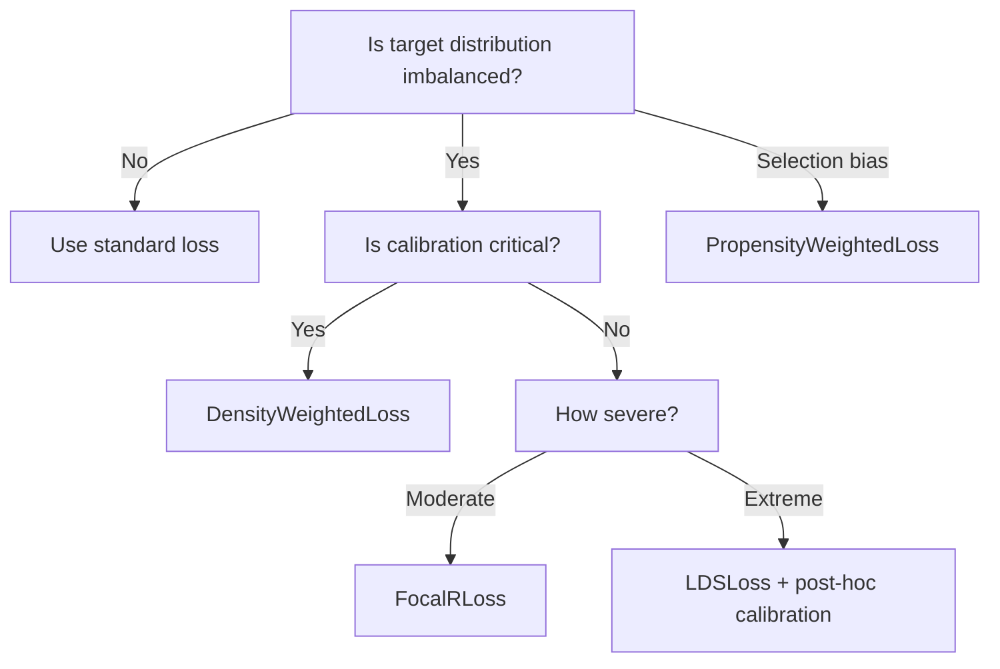

# Imbalanced Regression

Imbalanced regression addresses problems where the target distribution is **highly non-uniform** — some regions (e.g., extreme values) are severely underrepresented.  Standard MSE optimises average performance, causing the model to ignore rare-but-important regions.

---

## The Problem

$$\mathcal{L}_{\text{standard}} = \frac{1}{N}\sum_{i=1}^N \ell(f(x_i), y_i) \quad \xrightarrow{\text{reweight}} \quad \mathcal{L}_{\text{balanced}} = \frac{1}{N}\sum_{i=1}^N w(y_i)\;\ell(f(x_i), y_i)$$

!!! warning "Calibration risk"
    Reweighting changes the effective training distribution.  **DensityWeightedLoss** preserves calibration; **LDSLoss** may break it.  Always validate calibration after training.

---

## Available Losses

| Loss | Method | Calibration | Pre-fitting |
|:-----|:-------|:-----------:|:-----------:|
| `DensityWeightedLoss` | Inverse kernel-density weights | ✅ Safe | `fit_density(y)` |
| `LDSLoss` | Smoothed label distribution | ⚠️ May break | `fit(y)` |
| `PropensityWeightedLoss` | Inverse propensity scores | ✅ With correct scores | None |
| `FocalRLoss` | Sigmoid-scaled error emphasis | ✅ Mostly | None |

---

## DensityWeightedLoss

Weights samples inversely proportional to local target density via KDE:

```python
from torchregress.losses import DensityWeightedLoss

loss_fn = DensityWeightedLoss(kernel_width=0.5, base_loss="mse", reweight_factor=1.0)
loss_fn.fit_density(y_train)  # estimate density once

# Training loop
loss = loss_fn(model(x), y)
```

| Parameter | Type | Default | Description |
|:----------|:-----|:--------|:------------|
| `kernel_width` | `float` | `0.5` | KDE bandwidth (smaller → more local) |
| `base_loss` | `str` | `"mse"` | `"mse"`, `"mae"`, or `"huber"` |
| `reweight_factor` | `float` | `1.0` | Interpolation: 0 = uniform, 1 = full inverse density |

!!! tip "Recommended first choice"
    DensityWeightedLoss preserves calibration and is the safest default for imbalanced regression.

---

## LDSLoss

**Label Distribution Smoothing** — smoother, more aggressive reweighting using kernel-smoothed bin frequencies:

```python
from torchregress.losses import LDSLoss

loss_fn = LDSLoss(kernel="gaussian", kernel_width=2.0, reweight_factor=0.8)
loss_fn.fit(y_train, n_bins=100)

loss = loss_fn(model(x), y)
```

| Parameter | Type | Default | Description |
|:----------|:-----|:--------|:------------|
| `kernel` | `str` | `"gaussian"` | `"gaussian"`, `"triang"`, or `"laplace"` |
| `kernel_width` | `float` | `2.0` | Smoothing bandwidth |
| `reweight_factor` | `float` | `1.0` | Reweight interpolation |
| `base_loss` | `str` | `"mse"` | `"mse"`, `"mae"`, or `"huber"` |

!!! warning "Calibration"
    LDS modifies the effective training distribution through smoothing.  Apply post-hoc calibration (e.g., isotonic regression, temperature scaling) before deployment.

---

## PropensityWeightedLoss

**Inverse-propensity weighting** for selection bias correction — re-weights observed samples by estimated probability of being observed:

```python
from torchregress.losses import PropensityWeightedLoss

loss_fn = PropensityWeightedLoss(
    base_loss="mse",
    clip_min=0.01,       # floor propensity to avoid extreme weights
    clip_max=0.99,
    normalize_weights=True,
)

# propensity: P(observed | x) estimated externally (e.g., logistic regression)
loss = loss_fn(model(x), y, propensity=p_scores, observed=obs_mask)
```

| Parameter | Type | Default | Description |
|:----------|:-----|:--------|:------------|
| `base_loss` | `str` | `"mse"` | `"mse"`, `"mae"`, or `"huber"` |
| `clip_min` | `float` | `0.01` | Minimum propensity (prevents extreme weights) |
| `clip_max` | `float` | `0.99` | Maximum propensity |
| `normalize_weights` | `bool` | `True` | Normalise IPW weights to sum to batch size |

!!! info "When to use"
    Use when you have **selection bias** — not all targets are equally likely to be observed (e.g., censored data, missing-not-at-random, survey sampling).

---

## FocalRLoss

**Focal loss for regression** — adaptively upweights samples with larger prediction errors:

$$w_i = \sigma(\beta \cdot |r_i|)^\gamma, \qquad \mathcal{L} = \sum_i w_i \cdot \ell_i$$

```python
from torchregress.losses import FocalRLoss

loss_fn = FocalRLoss(beta=0.2, gamma=1.0, base_loss="mse")
loss = loss_fn(model(x), y)
```

| Parameter | Type | Default | Description |
|:----------|:-----|:--------|:------------|
| `beta` | `float` | `0.2` | Error scaling in sigmoid |
| `gamma` | `float` | `1.0` | Focus strength (higher → more emphasis on hard samples) |
| `base_loss` | `str` | `"mse"` | `"mse"`, `"mae"`, or `"huber"` |

!!! tip "No pre-fitting needed"
    Unlike density-based methods, FocalRLoss doesn't require a separate `fit` step — it adapts automatically during training.

---

## Decision Guide



---

## References

| # | Reference |
|:-:|:----------|
| 1 | Y. Yang et al. "Delving into Deep Imbalanced Regression." *ICML*, **2021**. |
| 2 | T.-Y. Lin et al. "Focal Loss for Dense Object Detection." *ICCV*, **2017**. |
