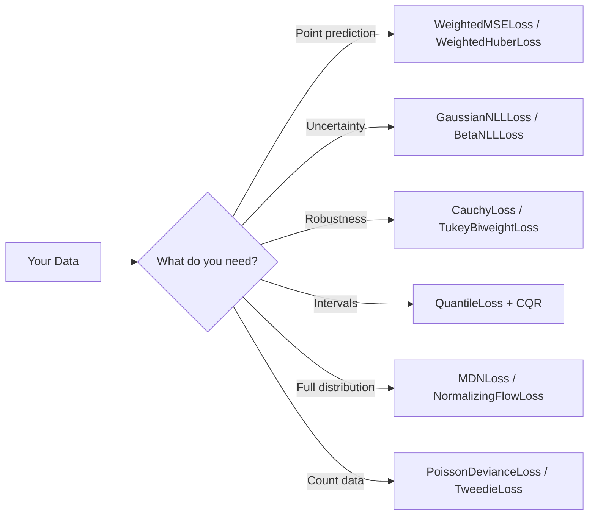

# Loss Functions

torchregress provides a comprehensive library of loss functions for regression — from simple point predictions to full distributional models with uncertainty quantification. This page is the **catalogue**: every loss family with its formula, use case, and link to the full guide.

!!! tip "Where to start?"
    Use the [Task-First Method Selection Matrix](../guide/method-selection.md) to shortlist losses by problem type.  For prediction intervals with coverage guarantees, see [Conformal Prediction](../methods/conformal/index.md).

    Reading order: start with [Standard Losses](#standard-losses) and [Gaussian Losses](#gaussian-losses), then jump to the section matching your data's pathology (outliers, censoring, imbalance, measurement error, etc.).

---

## At a Glance

---

## Standard Losses

The building blocks — these wrap PyTorch losses with unified support for **masks**, **sample weights**, and consistent reduction semantics.

---

### torchregress vs PyTorch native — why both exist

Several torchregress losses share names with `torch.nn` primitives. They are **not**
redundant — each adds mask/weight support that native losses lack:

| torchregress | PyTorch nearest | Why torchregress exists |
|:-------------|:---------------|:------------------------|
| `WeightedMSELoss` | `nn.MSELoss` | Adds **mask** (missing-data) and per-sample **weight** support | [`WeightedMSELoss`](../api/losses.md) |
| `WeightedL1Loss` | `nn.L1Loss` | Same mask + weight pattern | [`WeightedL1Loss`](../api/losses.md) |
| `WeightedHuberLoss` | `nn.HuberLoss` | Same mask + weight pattern | [`WeightedHuberLoss`](../api/losses.md) |
| `WeightedLossWrapper` | any `nn.Module` | Generic wrapper adding mask/weight to any PyTorch loss | [`WeightedLossWrapper`](../api/losses.md) |
| `WeightedCrossEntropyLoss` | `nn.CrossEntropyLoss` | Mask + weight for regression-as-classification workflows |
| `WeightedNLLLoss` | `nn.NLLLoss` | Mask + weight for regression-as-classification workflows |
| `GaussianNLLLoss` | `nn.GaussianNLLLoss` | Adds **covariance-type dispatch** (diagonal / full / low-rank) via `create_gaussian_nll()`, mask support, and self-agreement contracts | [`GaussianNLLLoss`](../api/losses.md) |
| `PseudoHuberLoss` | `nn.HuberLoss` | Continuous second derivative (C² smooth) vs native Huber's C¹; mask support |

**Every other loss in torchregress has no PyTorch-native equivalent** — they are
domain-specific formulations for uncertainty quantification, robust regression,
censored/ordinal targets, error-in-variables, conformal prediction, etc.

!!! tip "Rule of thumb"
    - Use **`torch.nn.MSELoss` / `L1Loss`** for plain regression with no missing data.
    - Use **torchregress `Weighted*` wrappers** when you need mask or per-sample weight support.
    - Use **torchregress probabilistic losses** (`GaussianNLLLoss`, `MDNLoss`, etc.) for
      uncertainty-aware regression — they handle distribution contracts that native losses don't.

---

| Loss | Formula (per sample) | Implied Distribution | API |
|:-----|:---------------------|:---------------------|:----|
| `WeightedMSELoss` | $(y - \hat{y})^2$ | Gaussian (fixed $\sigma$) | [`WeightedMSELoss`](../api/losses.md) |
| `WeightedL1Loss` | $\lvert y - \hat{y}\rvert$ | Laplace | [`WeightedL1Loss`](../api/losses.md) |
| `WeightedHuberLoss` | Quadratic core + linear tails | Gaussian-Laplace hybrid | [`WeightedHuberLoss`](../api/losses.md) |
| `GaussianNLLLoss` | Heteroscedastic NLL wrapper | Gaussian | [`GaussianNLLLoss`](../api/losses.md) |
| `WeightedCrossEntropyLoss` | Classification wrapper | Categorical | [Losses API](../api/losses.md) (weighted wrappers) |

See [Base Classes](base.md) for foundations.

---

## Gaussian Losses

Parametric losses for the Gaussian family — supporting **heteroscedastic** (input-dependent) variance.

| Loss | Outputs Predicted | Use Case | API |
|:-----|:-----------------|:---------|:----|
| `GaussianNLLLoss` | $\mu, \log\sigma^2$ | Heteroscedastic uncertainty per sample | [`GaussianNLLLoss`](../api/losses.md) |
| `BetaNLLLoss` | $\mu, \log\sigma^2$ | Heteroscedastic NLL with detached variance rescaling (β-NLL) | [`BetaNLLLoss`](../api/losses.md) |
| `GaussianWassersteinBoundLoss` | $\mu$, covariance params | Mean + matrix-root Frobenius surrogate vs target covariance | [`GaussianWassersteinBoundLoss`](../api/losses.md) |
| `GaussianNLLLoss(fixed_variance=σ²)` | $\mu$ only | Homoscedastic (reduces to scaled MSE) | [`GaussianNLLLoss`](../api/losses.md) |
| `MultivariateGaussianLoss` | $\boldsymbol{\mu}, \mathbf{L}$ | Correlated multi-output regression | [`MultivariateGaussianLoss`](../api/losses.md) |
| `LowRankGaussianLoss` | $\boldsymbol{\mu}, \mathbf{U}, \mathbf{d}$ | Scalable multivariate ($\Sigma = UU^\top + \text{diag}(d)$) | [`LowRankGaussianLoss`](../api/losses.md) |
| `create_gaussian_nll()` | — | Factory: picks the right variant |

!!! info "GaussianNLL ↔ WeightedMSE continuum"
    Setting `GaussianNLLLoss(fixed_variance=σ²)` makes the model predict **only the mean**, and the loss reduces to a **scaled MSE**.  The factory `create_gaussian_nll(use_mse_for_unit_variance=True)` returns `WeightedMSELoss` when variance is fixed at 1.  This means GaussianNLL and MSE are endpoints of a **single continuum**.

Read the full [Gaussian losses guide](gaussian.md) for deep dives on diagonal, full-covariance, and low-rank variants. Also see [Beta-NLL](beta_nll.md) for stabilized training and [Wasserstein bound](gaussian_wasserstein.md) for covariance supervision.

---

## Robust Losses

Bounded-influence losses for data with **outliers** or heavy-tailed noise.

| Loss | Score Function $\rho(r)$ | Tail Behaviour | Robustness |
|:-----|:------------------------|:---------------|:----------:|
| `PseudoHuberLoss` | $\delta^2(\sqrt{1 + r^2/\delta^2} - 1)$ | Linear | ⭐⭐ |
| `LogCoshLoss` | $\log\cosh(r)$ | Linear | ⭐⭐ |
| `CharbonnierLoss` | $\sqrt{r^2 + \epsilon^2} - \epsilon$ | Linear | ⭐⭐ |
| `CauchyLoss` | $\log(1 + r^2/c^2)$ | Logarithmic | ⭐⭐⭐ |
| `TukeyBiweightLoss` | Bounded (rejects $\lvert r\rvert > c$) | Zero | ⭐⭐⭐⭐ |
| `CVaRLoss` | Worst-$\alpha$ fraction | Tail-focused | ⭐⭐⭐ |

Read the full [Robust losses guide](robust.md) — influence functions, redescending behavior, Barron family, CVaR.

---

## Quantile & Expectile Losses

Distribution-free models for **specific aspects** of the conditional distribution.

| Loss | What it Predicts | Math |
|:-----|:----------------|:-----|
| `QuantileLoss` | $\hat{q}_\tau$: conditional quantile | $\rho_\tau(y - \hat{q}_\tau)$ where $\rho_\tau(u) = u(\tau - \mathbf{1}_{u<0})$ |
| `MultiQuantileLoss` | Multiple quantiles simultaneously | $\sum_\tau \rho_\tau(y - \hat{q}_\tau)$ |
| `ExpectileLoss` | $\hat{e}_\tau$: conditional expectile | $\lvert\tau - \mathbf{1}_{y < \hat{e}_\tau}\rvert(y - \hat{e}_\tau)^2$ |
| `MultiExpectileLoss` | Multiple expectiles | — |
| `QuantileCrossoverLoss` | — | Penalises $\hat{q}_{\tau_1} > \hat{q}_{\tau_2}$ when $\tau_1 < \tau_2$ |

Read the full [Quantile & Expectile guide](quantile_expectile.md) — crossover penalties, multi-level prediction intervals, expectile-to-quantile conversion.

---

## Ordinal Losses

For **ordered categorical** targets where class distance matters.

| Loss | Method | Outputs |
|:-----|:-------|:--------|
| `OrdinalCrossEntropyLoss` | Standard CE (baseline) | $K$ logits |
| `CumulativeLinkLoss` | Cumulative-threshold model | $K-1$ logits |
| `CORALLoss` | Consistent Rank Logits | $K-1$ binary logits |

Read the full [Ordinal losses guide](ordinal.md) — cumulative link, CORAL, cross-entropy baselines.

---

## Censored Regression Losses

For **partially observed** outcomes — right/left/interval censoring.

| Loss | Censoring Model | Use Case |
|:-----|:---------------|:---------|
| `CensoredGaussianNLLLoss` | Gaussian + $\Phi$ | Clipped sensors, detection limits |
| `CensoredQuantileLoss` | Quantile + censoring | Non-parametric censored regression |
| `AFTLoss` | Accelerated Failure Time | Survival analysis |

Read the full [Censored losses guide](censored.md) — Gaussian censored NLL, AFT survival models, quantile censoring.

---

## Poisson, Tweedie & Count Losses

For **count data** and targets with specific mean-variance relationships.

| Loss | Model | Best For |
|:-----|:------|:---------|
| `PoissonDevianceLoss` | $\text{Var} = \mu$ | Standard counts |
| `NegativeBinomialNLLLoss` | $\text{Var} = \mu + \mu^2/r$ | Overdispersed counts |
| `ZeroInflatedPoissonNLLLoss` | ZI-Poisson | Counts with excess zeros |
| `TweedieLoss` | $\text{Var} = \phi\mu^p$ | Flexible power model |
| `GammaLoss` | Gamma | Positive, right-skewed |
| `InverseGaussianLoss` | Inverse Gaussian | Positive, $\text{Var} \propto \mu^3$ |
| `CompoundPoissonLoss` | Compound Poisson | Zeros + continuous positives |

Read the [Poisson & Tweedie guide](poisson_tweedie.md) for count models and [Poisson-Gaussian](poisson_gaussian.md) for mixed readout-noise models.

---

## Evidential Regression

Single-forward-pass **aleatoric + epistemic** decomposition via a Normal-Inverse-Gamma prior:

$$\mu \sim \mathcal{N}\!\bigl(\gamma,\, \sigma^2/\nu\bigr), \qquad \sigma^2 \sim \text{Inv-Gamma}(\alpha, \beta)$$

| Loss | What it Does |
|:-----|:------------|
| `EvidentialRegressionLoss` | Predicts $(\gamma, \nu, \alpha, \beta)$; uncertainty without ensembles |

Read the full [Evidential regression guide](advanced.md) — Normal-Inverse-Gamma prior, single-pass decomposition, calibration caveats.

---

## Mixture Density Networks (MDN)

For **multimodal** conditional distributions:

$$p(y \mid x) = \sum_{k=1}^K \pi_k(x)\,\mathcal{N}\!\bigl(y \mid \mu_k(x),\, \sigma_k^2(x)\bigr)$$

| Loss | Description |
|:-----|:-----------|
| `MixtureDensityLoss` / `MDNLoss` | NLL for Gaussian mixtures |
| `create_mdn_loss()` | Factory function |

Read the full [MDN guide](mdn.md) — component selection, label switching, mixture-of-mixtures ensembles.

---

## Normalizing Flows

For **arbitrarily complex** conditional distributions:

| Loss | Description |
|:-----|:-----------|
| `NormalizingFlowLoss` | NLL via change-of-variables (requires `zuko`) |
| `ContrastiveFlowLoss` | Contrastive likelihood-ratio training over positive vs alternate contexts |
| `create_flow_model()` / `create_flow_loss()` / `create_contrastive_flow_loss()` | Factory functions |

Read the full [Normalizing flows guide](nflows.md) — NSF/RealNVP/MAF architectures, contrastive flow variant, inference sampling.

---

## Error-in-Variables Losses

For regression when **inputs have measurement uncertainty**:

| Loss | Model | When to Use |
|:-----|:------|:------------|
| `StructuralEIVLoss` | Known error ratio $\lambda$ | Known $\sigma_x / \sigma_y$ |
| `FunctionalEIVLoss` | Per-sample $\sigma_x$ | Heteroscedastic input noise |
| `OrthogonalDistanceRegressionLoss` | Perpendicular distances | General EIV |
| `EnsembleEIVLoss` | Ensemble disagreement | No known error model |

Read the full [EIV losses guide](eiv.md) for loss-based correction, or see the algorithm pages for [Regression Calibration](../methods/algorithms/rc.md) and [SIMEX](../methods/algorithms/simex.md).

---

## Imbalanced Regression

For targets with significant **distribution imbalance**:

| Loss | Strategy |
|:-----|:---------|
| `DensityWeightedLoss` | Inverse target-density reweighting |
| `FocalRLoss` | Focus on hard examples |
| `LDSLoss` | Label Distribution Smoothing |
| `PropensityWeightedLoss` | Inverse propensity scores |

Read the full [Imbalanced regression guide](imbalanced.md) — density weighting, Focal-R, LDS, propensity weighting.

---

## Noisy Labels & Uncertain Ground Truth

| Loss | Strategy |
|:-----|:---------|
| `NoisyTargetGaussianNLL` | Adds known target-noise $\sigma_y^2$ to predicted variance |
| `ConsistencyRegLoss` | Teacher-student consistency |
| `PseudoLabelNLL` | Blends observed + pseudo labels |
| `PseudoLabelConsistencyLoss` | Single objective for pseudo-label + teacher-consistency point-regression training |

Read the [Noisy labels guide](noisy_labels.md) for target-noise-aware NLL and consistency losses, or the [Uncertain GT guide](uncertain_ground_truth.md) for pseudo-label workflows.

---

## Transform Losses

| Loss | Strategy |
|:-----|:---------|
| `LogTransformLoss` | Optimize in log space for positive multiplicative-noise targets |
| `BoxCoxTransformLoss` | Tunable positive-support power transform |
| `SqrtTransformLoss` | Variance-stabilizing square-root transform |
| `YeoJohnsonTransformLoss` | Signed-target power transform |

Read the full [Transform losses guide](transforms.md) — log, Box-Cox, sqrt, Yeo-Johnson transforms, and the generic `TransformedTargetLoss` wrapper.

---

## Loss Selection Guide

| If you need… | Start with… | Then consider… |
|:-------------|:-----------|:--------------|
| Simple regression | `WeightedMSELoss` | `WeightedHuberLoss` for robustness |
| Outlier robustness | `WeightedHuberLoss` | `CauchyLoss` or `TukeyBiweightLoss` |
| Prediction intervals | `MultiQuantileLoss` | + [CQR](../methods/conformal/predictors.md#cqr) for guarantees |
| Heteroscedastic uncertainty | `GaussianNLLLoss` | + [Ensemble](../methods/ensemble/index.md) for epistemic |
| Full distribution | `MixtureDensityLoss` | `NormalizingFlowLoss` for more flexibility |
| Single-pass uncertainty | `EvidentialRegressionLoss` | Ensemble for better calibration |
| Count data | `PoissonDevianceLoss` | `NegativeBinomialNLLLoss` for overdispersion |
| Data with zeros | `TweedieLoss` | `CompoundPoissonLoss` for mixed |
| Imbalanced targets | `DensityWeightedLoss` | `FocalRLoss` or `LDSLoss` |
| Noisy labels | `NoisyTargetGaussianNLL` | `ConsistencyRegLoss` |
| Semi-supervised regression | `PseudoLabelConsistencyLoss` | `PseudoLabelNLL` |
| Strong target skew / multiplicative noise | `LogTransformLoss` | `BoxCoxTransformLoss` or `SqrtTransformLoss` |
| Measurement error | `StructuralEIVLoss` | [RC](../methods/algorithms/rc.md) or [SIMEX](../methods/algorithms/simex.md) |
| Ordered categories | `CumulativeLinkLoss` | `CORALLoss` |
| Censored/survival | `CensoredGaussianNLLLoss` | `AFTLoss` |
