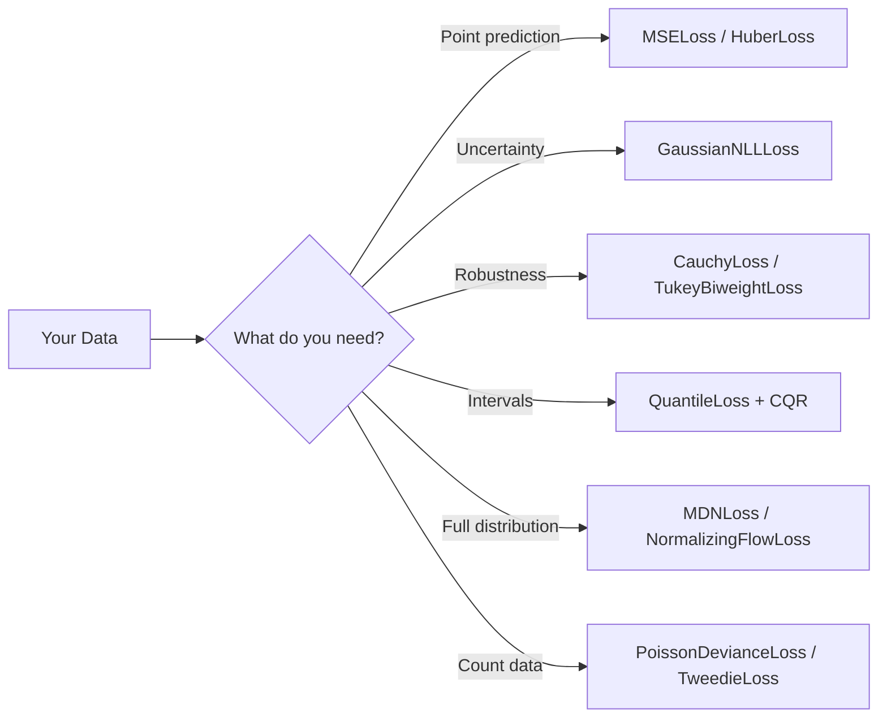

# Loss Functions

torchregress provides a comprehensive library of loss functions for regression — from simple point predictions to full distributional models with uncertainty quantification.

!!! tip "Where to start?"
    Use the [Task-First Method Selection Matrix](../guides/method_selection_matrix.md) to shortlist losses by problem type.  For prediction intervals with coverage guarantees, see [Conformal Prediction](../conformal/index.md).

---

## At a Glance

---

## Standard Losses

The building blocks — these wrap PyTorch losses with unified support for **masks**, **sample weights**, and consistent reduction semantics.

| Loss | Formula (per sample) | Implied Distribution |
|:-----|:---------------------|:---------------------|
| `MSELoss` | $(y - \hat{y})^2$ | Gaussian (fixed $\sigma$) |
| `L1Loss` / `WeightedMAELoss` | $\lvert y - \hat{y}\rvert$ | Laplace |
| `HuberLoss` | Quadratic core + linear tails | Gaussian-Laplace hybrid |
| `WeightedGaussianNLLLoss` | PyTorch-compatible wrapper | Gaussian |
| `WeightedCrossEntropyLoss` | Classification wrapper | Categorical |

See [Base Classes](base.md) for foundations.

---

## Gaussian Losses

Parametric losses for the Gaussian family — supporting **heteroscedastic** (input-dependent) variance.

| Loss | Outputs Predicted | Use Case |
|:-----|:-----------------|:---------|
| `GaussianNLLLoss` | $\mu, \log\sigma^2$ | Heteroscedastic uncertainty per sample |
| `GaussianNLLLoss(fixed_variance=σ²)` | $\mu$ only | Homoscedastic (reduces to scaled MSE) |
| `MultivariateGaussianLoss` | $\boldsymbol{\mu}, \mathbf{L}$ | Correlated multi-output regression |
| `LowRankGaussianLoss` | $\boldsymbol{\mu}, \mathbf{U}, \mathbf{d}$ | Scalable multivariate ($\Sigma = UU^\top + \text{diag}(d)$) |
| `create_gaussian_nll()` | — | Factory: picks the right variant |

!!! info "GaussianNLL ↔ WeightedMSE continuum"
    Setting `GaussianNLLLoss(fixed_variance=σ²)` makes the model predict **only the mean**, and the loss reduces to a **scaled MSE**.  The factory `create_gaussian_nll(use_mse_for_unit_variance=True)` returns `WeightedMSELoss` when variance is fixed at 1.  This means GaussianNLL and MSE are endpoints of a **single continuum**.

→ [Gaussian Losses reference](gaussian.md)

---

## Robust Losses

Bounded-influence losses for data with **outliers** or heavy-tailed noise.

| Loss | Score Function $\rho(r)$ | Tail Behaviour | Robustness |
|:-----|:------------------------|:---------------|:----------:|
| `PseudoHuberLoss` | $\delta^2(\sqrt{1 + r^2/\delta^2} - 1)$ | Linear | ⭐⭐ |
| `LogCoshLoss` | $\log\cosh(r)$ | Linear | ⭐⭐ |
| `CharbonnierLoss` | $\sqrt{r^2 + \epsilon^2} - \epsilon$ | Linear | ⭐⭐ |
| `CauchyLoss` | $\log(1 + r^2/c^2)$ | Logarithmic | ⭐⭐⭐ |
| `TukeyBiweightLoss` | Bounded (rejects $\lvert r\rvert > c$) | Zero | ⭐⭐⭐⭐ |
| `CVaRLoss` | Worst-$\alpha$ fraction | Tail-focused | ⭐⭐⭐ |

→ [Robust Losses reference](robust.md)

---

## Quantile & Expectile Losses

Distribution-free models for **specific aspects** of the conditional distribution.

| Loss | What it Predicts | Math |
|:-----|:----------------|:-----|
| `QuantileLoss` | $\hat{q}_\tau$: conditional quantile | $\rho_\tau(y - \hat{q}_\tau)$ where $\rho_\tau(u) = u(\tau - \mathbf{1}_{u<0})$ |
| `MultiQuantileLoss` | Multiple quantiles simultaneously | $\sum_\tau \rho_\tau(y - \hat{q}_\tau)$ |
| `ExpectileLoss` | $\hat{e}_\tau$: conditional expectile | $\lvert\tau - \mathbf{1}_{y < \hat{e}_\tau}\rvert(y - \hat{e}_\tau)^2$ |
| `MultiExpectileLoss` | Multiple expectiles | — |
| `QuantileCrossoverLoss` | — | Penalises $\hat{q}_{\tau_1} > \hat{q}_{\tau_2}$ when $\tau_1 < \tau_2$ |

→ [Quantile & Expectile reference](quantile_expectile.md)

---

## Ordinal Losses

For **ordered categorical** targets where class distance matters.

| Loss | Method | Outputs |
|:-----|:-------|:--------|
| `OrdinalCrossEntropyLoss` | Standard CE (baseline) | $K$ logits |
| `CumulativeLinkLoss` | Cumulative-threshold model | $K-1$ logits |
| `CORALLoss` | Consistent Rank Logits | $K-1$ binary logits |

→ [Ordinal Losses reference](ordinal.md)

---

## Censored Regression Losses

For **partially observed** outcomes — right/left/interval censoring.

| Loss | Censoring Model | Use Case |
|:-----|:---------------|:---------|
| `CensoredGaussianNLLLoss` | Gaussian + $\Phi$ | Clipped sensors, detection limits |
| `CensoredQuantileLoss` | Quantile + censoring | Non-parametric censored regression |
| `AFTLoss` | Accelerated Failure Time | Survival analysis |

→ [Censored Losses reference](censored.md)

---

## Poisson, Tweedie & Count Losses

For **count data** and targets with specific mean-variance relationships.

| Loss | Model | Best For |
|:-----|:------|:---------|
| `PoissonDevianceLoss` | $\text{Var} = \mu$ | Standard counts |
| `NegativeBinomialNLLLoss` | $\text{Var} = \mu + \mu^2/r$ | Overdispersed counts |
| `ZeroInflatedPoissonNLLLoss` | ZI-Poisson | Counts with excess zeros |
| `TweedieLoss` | $\text{Var} = \phi\mu^p$ | Flexible power model |
| `GammaLoss` | Gamma | Positive, right-skewed |
| `InverseGaussianLoss` | Inverse Gaussian | Positive, $\text{Var} \propto \mu^3$ |
| `CompoundPoissonLoss` | Compound Poisson | Zeros + continuous positives |

→ [Poisson & Tweedie reference](poisson_tweedie.md) · [Poisson-Gaussian reference](poisson_gaussian.md)

---

## Evidential Regression

Single-forward-pass **aleatoric + epistemic** decomposition via a Normal-Inverse-Gamma prior:

$$\mu \sim \mathcal{N}\!\bigl(\gamma,\, \sigma^2/\nu\bigr), \qquad \sigma^2 \sim \text{Inv-Gamma}(\alpha, \beta)$$

| Loss | What it Does |
|:-----|:------------|
| `EvidentialRegressionLoss` | Predicts $(\gamma, \nu, \alpha, \beta)$; uncertainty without ensembles |

→ [Evidential Regression reference](advanced.md)

---

## Mixture Density Networks (MDN)

For **multimodal** conditional distributions:

$$p(y \mid x) = \sum_{k=1}^K \pi_k(x)\,\mathcal{N}\!\bigl(y \mid \mu_k(x),\, \sigma_k^2(x)\bigr)$$

| Loss | Description |
|:-----|:-----------|
| `MixtureDensityLoss` / `MDNLoss` | NLL for Gaussian mixtures |
| `create_mdn_loss()` | Factory function |

→ [MDN reference](mdn.md)

---

## Normalizing Flows

For **arbitrarily complex** conditional distributions:

| Loss | Description |
|:-----|:-----------|
| `NormalizingFlowLoss` | NLL via change-of-variables (requires `zuko`) |
| `ContrastiveFlowLoss` | Contrastive likelihood-ratio training over positive vs alternate contexts |
| `create_flow_model()` / `create_flow_loss()` / `create_contrastive_flow_loss()` | Factory functions |

→ [Normalizing Flows reference](nflows.md)

---

## Error-in-Variables Losses

For regression when **inputs have measurement uncertainty**:

| Loss | Model | When to Use |
|:-----|:------|:------------|
| `StructuralEIVLoss` | Known error ratio $\lambda$ | Known $\sigma_x / \sigma_y$ |
| `FunctionalEIVLoss` | Per-sample $\sigma_x$ | Heteroscedastic input noise |
| `OrthogonalDistanceRegressionLoss` | Perpendicular distances | General EIV |
| `EnsembleEIVLoss` | Ensemble disagreement | No known error model |

→ [EIV Losses reference](eiv.md) · [RC algorithm](../algorithms/rc.md) · [SIMEX algorithm](../algorithms/simex.md)

---

## Imbalanced Regression

For targets with significant **distribution imbalance**:

| Loss | Strategy |
|:-----|:---------|
| `DensityWeightedLoss` | Inverse target-density reweighting |
| `FocalRLoss` | Focus on hard examples |
| `LDSLoss` | Label Distribution Smoothing |
| `PropensityWeightedLoss` | Inverse propensity scores |

→ [Imbalanced Regression reference](imbalanced.md)

---

## Noisy Labels & Uncertain Ground Truth

| Loss | Strategy |
|:-----|:---------|
| `NoisyTargetGaussianNLL` | Adds known target-noise $\sigma_y^2$ to predicted variance |
| `ConsistencyRegLoss` | Teacher-student consistency |
| `PseudoLabelNLL` | Blends observed + pseudo labels |
| `PseudoLabelConsistencyLoss` | Single objective for pseudo-label + teacher-consistency point-regression training |

→ [Noisy Labels reference](noisy_labels.md) · [Uncertain GT reference](uncertain_ground_truth.md)

---

## Transform Losses

| Loss | Strategy |
|:-----|:---------|
| `LogTransformLoss` | Optimize in log space for positive multiplicative-noise targets |
| `BoxCoxTransformLoss` | Tunable positive-support power transform |
| `SqrtTransformLoss` | Variance-stabilizing square-root transform |
| `YeoJohnsonTransformLoss` | Signed-target power transform |

→ [Transform Losses reference](transforms.md)

---

## Loss Selection Guide

| If you need… | Start with… | Then consider… |
|:-------------|:-----------|:--------------|
| Simple regression | `MSELoss` | `HuberLoss` for robustness |
| Outlier robustness | `HuberLoss` | `CauchyLoss` or `TukeyBiweightLoss` |
| Prediction intervals | `MultiQuantileLoss` | + [CQR](../conformal/predictors.md#cqr) for guarantees |
| Heteroscedastic uncertainty | `GaussianNLLLoss` | + [Ensemble](../ensemble/index.md) for epistemic |
| Full distribution | `MixtureDensityLoss` | `NormalizingFlowLoss` for more flexibility |
| Single-pass UQ | `EvidentialRegressionLoss` | Ensemble for better calibration |
| Count data | `PoissonDevianceLoss` | `NegativeBinomialNLLLoss` for overdispersion |
| Data with zeros | `TweedieLoss` | `CompoundPoissonLoss` for mixed |
| Imbalanced targets | `DensityWeightedLoss` | `FocalRLoss` or `LDSLoss` |
| Noisy labels | `NoisyTargetGaussianNLL` | `ConsistencyRegLoss` |
| Semi-supervised regression | `PseudoLabelConsistencyLoss` | `PseudoLabelNLL` |
| Strong target skew / multiplicative noise | `LogTransformLoss` | `BoxCoxTransformLoss` or `SqrtTransformLoss` |
| Measurement error | `StructuralEIVLoss` | [RC](../algorithms/rc.md) or [SIMEX](../algorithms/simex.md) |
| Ordered categories | `CumulativeLinkLoss` | `CORALLoss` |
| Censored/survival | `CensoredGaussianNLLLoss` | `AFTLoss` |
