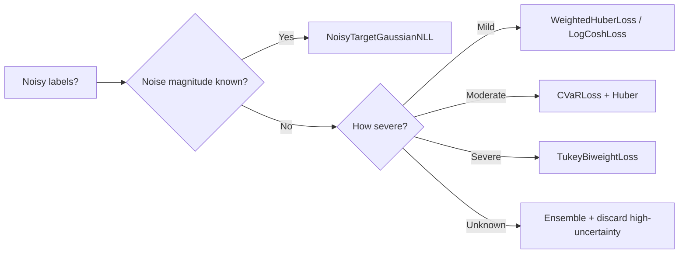

# Training with Noisy Labels

When target labels contain measurement noise, annotation errors, or systematic corruption, standard losses can overfit to the noise.  torchregress provides several **built-in** mechanisms for robust training under label noise.

---

## Approaches in torchregress

!!! info "No dedicated noisy-label meta-loss"
    torchregress handles label noise through **composable building blocks** already in the library: robust losses, tail-focused objectives, uncertain-target likelihoods, reweighting, and ensembles.

### 1. Robust Losses

The simplest defence — replace MSE with a loss that bounds the influence of large errors:

```python
from torchregress.losses import WeightedHuberLoss, TukeyBiweightLoss, CauchyLoss

# Huber: linear penalty beyond δ
loss_fn = WeightedHuberLoss(delta=1.0)

# Tukey: completely ignores errors beyond c
loss_fn = TukeyBiweightLoss(c=4.685)

# Cauchy: logarithmic suppression
loss_fn = CauchyLoss(c=1.0)
```

See [Robust Losses](robust.md) for details and a decision guide.

### 2. CVaR Loss (Tail-Focused)

Average only the top-$\alpha$ fraction of per-sample losses — effectively ignoring the easiest (potentially noisy) samples:

```python
from torchregress.losses import CVaRLoss

loss_fn = CVaRLoss(alpha=0.5, base_loss="huber")  # focus on harder 50%
```

### 3. Uncertain Ground Truth Losses

When label noise has **known or estimable variance**, use losses that explicitly model the noise:

```python
from torchregress.losses import NoisyTargetGaussianNLL

# Known label noise variance
loss_fn = NoisyTargetGaussianNLL()
```

See [Uncertain Ground Truth](uncertain_ground_truth.md) for `NoisyTargetGaussianNLL`, `ConsistencyRegLoss`, `PseudoLabelNLL`, and `PseudoLabelConsistencyLoss`.

### 4. Density / Propensity Weighting

Downweight samples in noisy regions using density or propensity scores:

```python
from torchregress.losses import DensityWeightedLoss, PropensityWeightedLoss

# Inverse-density weighting
loss_fn = DensityWeightedLoss(kernel_width=0.5)
loss_fn.fit_density(y_train)

# Inverse-propensity weighting
loss_fn = PropensityWeightedLoss(clip_min=0.01)
```

See [Imbalanced Regression](imbalanced.md).

### 5. Ensemble Disagreement

Train an ensemble and use member disagreement to identify noisy samples:

```python
from torchregress.ensemble import DeepEnsemble

ensemble = DeepEnsemble(base_model, n_members=5)
# After training, samples with high epistemic uncertainty
# (large variance across members) are likely mislabelled
```

See [Ensemble Methods](../methods/ensemble/methods.md).

---

## Practical Workflow



---

## References

| # | Reference |
|:-:|:----------|
| 1 | P.J. Huber. ["Robust Estimation of a Location Parameter."](https://projecteuclid.org/journals/annals-of-mathematical-statistics/volume-35/issue-1/Robust-Estimation-of-a-Location-Parameter/10.1214/aoms/1177703732.full) *Ann. Math. Stat.*, **1964**. |
| 2 | D. Arpit et al. ["A Closer Look at Memorization in Deep Networks."](https://arxiv.org/abs/1611.03530) *ICML*, **2017**. |
| 3 | B. Han et al. ["Co-teaching: Robust Training of Deep Neural Networks with Extremely Noisy Labels."](https://arxiv.org/abs/1804.06872) *NeurIPS*, **2018**. |
