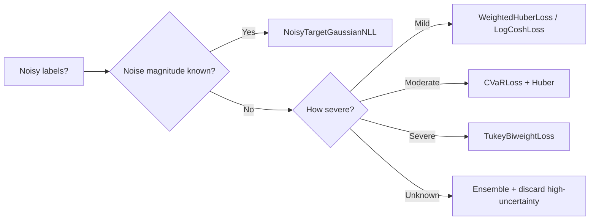

# Training with Noisy Labels

> ← [Imbalanced Regression](imbalanced.md) | [Uncertain Ground Truth](uncertain_ground_truth.md) →

When target labels contain measurement noise, annotation errors, or systematic corruption, standard losses can overfit to the noise.  torchregress provides several **built-in** mechanisms for robust training under label noise.

!!! tip "Related content"
    Run the [Noisy Label Comparison](../examples/noisy_label_comparison.md) example to benchmark all approaches. For uncertain-target losses, see [Uncertain Ground Truth](uncertain_ground_truth.md).

---

## Approaches in torchregress

!!! info "No dedicated noisy-label meta-loss"
    torchregress handles label noise through **composable building blocks** already in the library: robust losses, tail-focused objectives, uncertain-target likelihoods, reweighting, and ensembles.

### 1. Robust Losses

The simplest defence — replace MSE with a loss that bounds the influence of large errors:

```python
from torchregress.losses import WeightedHuberLoss, TukeyBiweightLoss, CauchyLoss

# Huber: linear penalty beyond δ
loss_fn = WeightedHuberLoss(delta=1.0)  # [API](../api/losses.md)

# Tukey: completely ignores errors beyond c
loss_fn = TukeyBiweightLoss(c=4.685)  # [API](../api/losses.md)

# Cauchy: logarithmic suppression
loss_fn = CauchyLoss(c=1.0)  # [API](../api/losses.md)
```

See [Robust Losses](robust.md) for details and a decision guide.

### 2. CVaR Loss (Tail-Focused)

Average only the worst-$\alpha$ fraction of per-sample losses (those with the **highest** loss values) — focusing training on the hardest / most outlying residuals:

```python
from torchregress.losses import CVaRLoss

loss_fn = CVaRLoss(alpha=0.5, base_loss="huber")  # [API](../api/losses.md)
```

### 3. Uncertain Ground Truth Losses

When label noise has **known or estimable variance**, use losses that explicitly model the noise:

```python
from torchregress.losses import NoisyTargetGaussianNLL

# Known label noise variance
loss_fn = NoisyTargetGaussianNLL()  # [API](../api/losses.md)
```

See [Uncertain Ground Truth](uncertain_ground_truth.md) for `NoisyTargetGaussianNLL`, `ConsistencyRegLoss`, `PseudoLabelNLL`, and `PseudoLabelConsistencyLoss`.

### 4. Density / Propensity Weighting

Downweight samples in noisy regions using density or propensity scores:

```python
from torchregress.losses import DensityWeightedLoss, PropensityWeightedLoss

# Inverse-density weighting
loss_fn = DensityWeightedLoss(kernel_width=0.5)  # [API](../api/losses.md)
loss_fn.fit_density(y_train)

# Inverse-propensity weighting
loss_fn = PropensityWeightedLoss(clip_min=0.01)  # [API](../api/losses.md)
```

See [Imbalanced Regression](imbalanced.md).

### 5. Ensemble Disagreement

Train an ensemble and use member disagreement to identify noisy samples:

```python
from torchregress.ensemble import DeepEnsemble

ensemble = DeepEnsemble(base_model, ensemble_size=5)
# After training, samples with high epistemic uncertainty
# (large variance across members) are likely mislabelled
```

See [Ensemble Methods](../methods/ensemble/methods.md).

---

## Practical Workflow



---

## Limitations

1. **No dedicated noisy-label meta-loss**: torchregress handles label noise through composable building blocks (robust losses, CVaR, density weighting, ensembles). There is no single "noisy label" loss that automatically detects and downweights mislabelled samples.
2. **Robust losses only bound influence**: Huber, Cauchy, and Tukey losses reduce the effect of outliers but do not identify or remove mislabelled samples. If a mislabelled point has a moderate residual, it still contributes to training.
3. **Ensemble disagreement requires multiple models**: Identifying noisy samples via ensemble epistemic uncertainty requires training 3–5 models, multiplying compute cost.
4. **CVaR is aggressive**: `CVaRLoss(alpha=0.1)` fits only the worst 10% of samples. If data quality is generally high, this overfits to the few genuine outliers and ignores the majority of clean data.

## Recommendations

- **Start with Huber**: `WeightedHuberLoss(delta=1.0)` is the simplest, cheapest defense against mild label noise. Upgrade to `CauchyLoss` or `TukeyBiweightLoss` only if you can confirm severe outliers.
- **Use CVaR for tail-focused objectives**: When you explicitly care about worst-case performance (fairness, safety-critical applications), `CVaRLoss` is the right tool. See the [CVaR demo](../examples/comprehensive_loss_comparison.py).
- **Ensemble for systematic noise**: If label noise is systematic (not just outliers), train a `DeepEnsemble` and inspect per-sample epistemic uncertainty to flag consistently mislabelled points.
- **When noise variance is known**: Use `NoisyTargetGaussianNLL` from [Uncertain ground truth](uncertain_ground_truth.md) — it directly models the target noise in the likelihood.

## Next steps

- [Uncertain ground truth](uncertain_ground_truth.md) — when noise variance is known or estimable
- [Robust losses](robust.md) — the simplest defense via bounded influence functions
- [Imbalanced regression](imbalanced.md) — density/propensity weighting strategies
- [Ensemble methods](../methods/ensemble/index.md) — use disagreement to identify noisy samples

---

## References

| # | Reference |
|:-:|:----------|
| 1 | P.J. Huber. ["Robust Estimation of a Location Parameter."](https://projecteuclid.org/journals/annals-of-mathematical-statistics/volume-35/issue-1/Robust-Estimation-of-a-Location-Parameter/10.1214/aoms/1177703732.full) *Ann. Math. Stat.*, **1964**. |
| 2 | D. Arpit et al. ["A Closer Look at Memorization in Deep Networks."](https://arxiv.org/abs/1706.05394) *ICML*, **2017**. |
| 3 | B. Han et al. ["Co-teaching: Robust Training of Deep Neural Networks with Extremely Noisy Labels."](https://arxiv.org/abs/1804.06872) *NeurIPS*, **2018**. |
