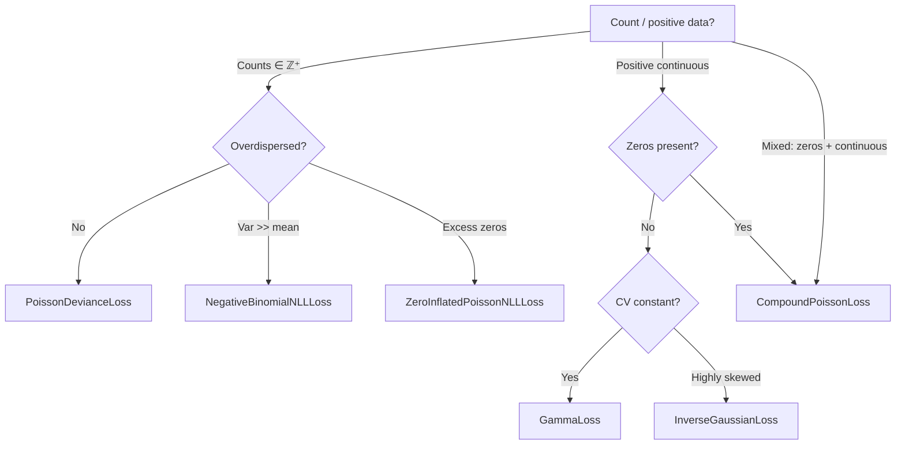

# Poisson, Tweedie & Count Losses

Loss functions for **count data**, **positive-continuous targets**, and distributions with **power mean-variance relationships**.

---

## Mathematical Background

The **Tweedie family** unifies many common models through a single power-variance relationship:

$$\boxed{\;\text{Var}(Y) = \phi\,\mu^p\;}$$

| Power $p$ | Distribution | Domain | Classic Use Case |
|:---------:|:------------|:-------|:----------------|
| $0$ | Normal | $\mathbb{R}$ | Standard regression |
| $1$ | Poisson | $\{0,1,2,\ldots\}$ | Event counts |
| $1 < p < 2$ | Compound Poisson-Gamma | $\{0\} \cup \mathbb{R}^+$ | Insurance claims, rainfall |
| $2$ | Gamma | $\mathbb{R}^+$ | Prices, durations, intensities |
| $3$ | Inverse Gaussian | $\mathbb{R}^+$ | Highly right-skewed positives |

---

## Poisson Losses

### PoissonDevianceLoss

The Poisson deviance (G-statistic) — measures goodness-of-fit for count data:

$$D(y, \lambda) = 2\sum_i\!\left[y_i \log\!\left(\frac{y_i}{\lambda_i}\right) - (y_i - \lambda_i)\right]$$

```python
from torchregress.losses import PoissonDevianceLoss

loss_fn = PoissonDevianceLoss(log_input=True)  # model predicts log(λ)
loss = loss_fn(log_lambda, y_counts)
```

| Parameter | Type | Default | Description |
|:----------|:-----|:--------|:------------|
| `log_input` | `bool` | `True` | If `True`, `y_pred` = $\log\lambda$ |
| `learn_variance` | `bool` | `False` | Learn a variance parameter |

### PoissonLikelihoodRatioLoss

Baker–Cousins likelihood ratio for **binned data** (PDG-standard):

$$-2\ln \Lambda = 2\sum_i\!\left[f_i - n_i + n_i \ln\!\left(\frac{n_i}{f_i}\right)\right]$$

```python
from torchregress.losses import PoissonLikelihoodRatioLoss

loss_fn = PoissonLikelihoodRatioLoss(log_input=True)
loss = loss_fn(log_expected, observed_counts)
```

!!! info "When to use"
    Preferred over Poisson deviance for histogram fitting (binned spectra, histograms) where the goodness-of-fit interpretation matters.  Standard in particle physics.

### ZeroInflatedPoissonNLLLoss

For count data with **excess zeros** beyond what a standard Poisson would predict:

$$P(Y = 0) = \pi + (1 - \pi)\,e^{-\lambda}, \qquad P(Y = k) = (1 - \pi)\,\frac{\lambda^k e^{-\lambda}}{k!}, \; k \geq 1$$

```python
from torchregress.losses import ZeroInflatedPoissonNLLLoss

loss_fn = ZeroInflatedPoissonNLLLoss(log_input=True)
# Model outputs [log(λ), logit(π)] concatenated
loss = loss_fn(model_output, y_counts)
```

!!! tip "When to use"
    Species counts (most plots have zero detections), manufacturing defects, rare disease incidence.

### NegativeBinomialNLLLoss

For **overdispersed** count data where $\text{Var}(Y) > \mathbb{E}[Y]$:

$$\text{Var}(Y) = \mu + \frac{\mu^2}{\theta}$$

```python
from torchregress.losses import NegativeBinomialNLLLoss

loss_fn = NegativeBinomialNLLLoss(learn_theta=True)  # learn dispersion
loss = loss_fn(y_pred_mean, y_counts)
```

| Parameter | Type | Default | Description |
|:----------|:-----|:--------|:------------|
| `learn_theta` | `bool` | `False` | Learn the dispersion parameter $\theta$ |
| `min_theta` | `float` | `1e-6` | Minimum $\theta$ for stability |

!!! tip "When to use"
    When Poisson is a poor fit (residual variance >> mean): gene expression counts (RNA-seq), ecological overdispersion, web traffic.

---

## Tweedie Losses

### TweedieLoss

General-purpose Tweedie deviance for any power $p$:

=== "$p = 0$ (Normal)"

    $$D(y, \mu) = \frac{1}{2}(y - \mu)^2$$

=== "$p = 1$ (Poisson)"

    $$D(y, \mu) = 2\bigl[\mu - y + y\log(y/\mu)\bigr]$$

=== "$p = 2$ (Gamma)"

    $$D(y, \mu) = 2\!\left[\log(\mu/y) + y/\mu - 1\right]$$

=== "$1 < p < 2$ (Compound Poisson)"

    $$D(y, \mu) = \frac{2}{(2-p)(1-p)}\!\left[y^{2-p} - (2-p)\,y\,\mu^{1-p} + (1-p)\,\mu^{2-p}\right]$$

```python
from torchregress.losses import TweedieLoss

# Compound Poisson-Gamma (zeros + positive continuous)
loss_fn = TweedieLoss(p=1.5, link="log")

# Model predicts log(μ)
loss = loss_fn(log_mu, y_target)
```

| Parameter | Type | Default | Description |
|:----------|:-----|:--------|:------------|
| `p` | `float` | `1.5` | Power parameter |
| `link` | `str` or `None` | `None` | `"log"` or `"identity"` |

### GammaLoss

Convenience class for $p = 2$ (positive continuous targets with constant CV):

```python
from torchregress.losses import GammaLoss

loss_fn = GammaLoss(link="log")
```

!!! tip "When to use"
    Prices, durations, insurance payouts — positive targets where the coefficient of variation is roughly constant.

### InverseGaussianLoss

For $p = 3$ (highly right-skewed positive targets):

```python
from torchregress.losses import InverseGaussianLoss

loss_fn = InverseGaussianLoss(link="log")
```

### CompoundPoissonLoss

For $1 < p < 2$ — handles data with a **point mass at zero** and positive continuous values:

```python
from torchregress.losses import CompoundPoissonLoss

loss_fn = CompoundPoissonLoss(p=1.5, link="log")
```

!!! info "Insurance example"
    In insurance, most policies have zero claims (point mass at 0), but claims that do occur are continuous and right-skewed — exactly the compound Poisson-Gamma model.

---

## Decision Guide



---

## Complete Example

```python
import torch
import torch.nn as nn
from torchregress.losses import TweedieLoss, NegativeBinomialNLLLoss

# Insurance claims: many zeros, occasional large payouts
class ClaimsModel(nn.Module):
    def __init__(self, in_dim):
        super().__init__()
        self.net = nn.Sequential(
            nn.Linear(in_dim, 64), nn.ReLU(),
            nn.Linear(64, 32), nn.ReLU(),
            nn.Linear(32, 1),
        )

    def forward(self, x):
        return self.net(x)  # predicts log(μ)

model = ClaimsModel(in_dim=20)
loss_fn = TweedieLoss(p=1.6, link="log")  # compound Poisson-Gamma
optimizer = torch.optim.Adam(model.parameters(), lr=1e-3)

for x, y in train_loader:
    loss = loss_fn(model(x), y)
    optimizer.zero_grad(); loss.backward(); optimizer.step()
```

---

## References

| # | Reference |
|:-:|:----------|
| 1 | B. Jørgensen. "Exponential Dispersion Models." *JRSS-B*, 49(2):127–162, **1987**. |
| 2 | P. Dunn, G. Smyth. "Evaluation of Tweedie Exponential Dispersion Model Densities." *J. Stat. Comp. Sim.*, 73(4):325–349, **2005**. |
| 3 | G.W. Corder, D.I. Foreman. *Nonparametric Statistics for Non-Statisticians*. Wiley, **2009**. |
| 4 | S. Baker, R.D. Cousins. "Clarification of the Use of Chi-square and Likelihood Functions in Fits to Histograms." *Nucl. Instr. Meth.*, 221(2):437–442, **1984**. |
| 5 | J. Nelder, R. Wedderburn. "Generalized Linear Models." *JRSS-A*, 135(3):370–384, **1972**. |
