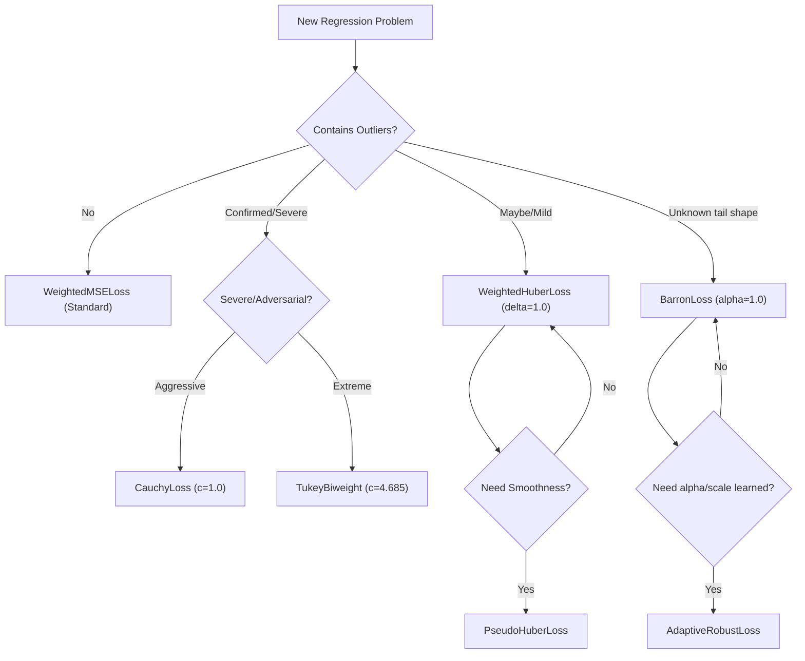

# Robust Loss Functions

Robust loss functions are designed to mitigate the influence of **outliers** — observations that deviate significantly from the primary data-generating process. Unlike standard Squared Error (MSE), which grows quadratically with the residual $r = y - \hat{y}$, robust losses grow more slowly (linearly or sub-linearly) at the tails.

---

## The Influence Function

To understand robustness, we examine the **influence function** $\psi(r) = \frac{\partial \rho}{\partial r}$. For MSE, $\psi(r) = 2r$, meaning a single large residual has an unbounded, linear influence on the gradients. Robust losses **bound** or **suppress** this influence.

| Loss | Function $\rho(r)$ | Influence $\psi(r)$ | API Reference |
|:-----|:-------------------|:-------------------|:--------------|
| **MSE** | $r^2$ | $2r$ (unbounded) | [WeightedMSELoss](../api/losses.md#weightedmseloss) |
| **MAE** | $|r|$ | $\text{sgn}(r)$ (bounded) | [WeightedL1Loss](../api/losses.md#weightedl1loss) |
| **Huber** | Piecewise $L_2/L_1$ | $\text{clamp}(r, -\delta, \delta)$ | [WeightedHuberLoss](../api/losses.md#weightedhuberloss) |
| **Cauchy** | $\log(1 + r^2/c^2)$ | $\frac{2r}{c^2 + r^2} \rightarrow 0$ | [CauchyLoss](../api/losses.md#cauchyloss) |
| **Tukey** | Redescending | $0$ for $|r| > c$ | [TukeyBiweightLoss](../api/losses.md#tukeybiweightloss) |
| **Barron** | General robust family | Varies with $\alpha$ | [BarronLoss](../api/losses.md#barronloss) |

---

## Core Robust Losses

### Huber & Pseudo-Huber

The **Huber Loss** \[1\] is the "gold standard" for robust regression. It provides the stability of $L_2$ near zero (ensuring a unique minimum) and the robustness of $L_1$ for large residuals.

$$\mathcal{L}_{\text{Huber}}(r; \delta) = \begin{cases} \tfrac{1}{2}r^2 & |r| \leq \delta \\ \delta\,|r| - \tfrac{1}{2}\delta^2 & |r| > \delta \end{cases}$$

The **Pseudo-Huber Loss** ([PseudoHuberLoss](../api/losses.md#pseudohuberloss)) is a smooth, $C^\infty$ approximation that is easier to optimise with second-order methods:

$$\mathcal{L}_{\text{PH}}(r; \delta) = \delta^2 \left( \sqrt{1 + (r/\delta)^2} - 1 \right)$$

```python
from torchregress.losses import WeightedHuberLoss, PseudoHuberLoss

# Traditional Huber (weighted wrapper)
loss_fn = WeightedHuberLoss(delta=1.345) # 95% efficiency for Gaussian

# Smooth Pseudo-Huber
loss_fn = PseudoHuberLoss(delta=1.0)
```

---

### Redescending Losses (Cauchy & Tukey)

"Redescending" losses are the most aggressive form of robustness. Their influence function $\psi(r)$ actually **returns to zero** for extreme residuals, meaning the model effectively "ignores" outliers once they are confirmed as such.

**Cauchy Loss** ([CauchyLoss](../api/losses.md#cauchyloss)):

$$\mathcal{L}_{\text{Cauchy}}(r; c) = \log\left(1 + \left(\frac{r}{c}\right)^2\right)$$

**Tukey Biweight** ([TukeyBiweightLoss](../api/losses.md#tukeybiweightloss)):

The ultimate outlier rejection tool \[2\]. Samples with $|r| > c$ contribute **zero gradient** to the model.

$$\mathcal{L}_{\text{Tukey}}(r; c) = \begin{cases} \frac{c^2}{6} \left[ 1 - (1 - (r/c)^2)^3 \right] & |r| \leq c \\ \frac{c^2}{6} & |r| > c \end{cases}$$

!!! warning "Optimization Limitations of Redescending Losses"
    - **Non-Convexity & Local Minima**: Cauchy and Tukey losses are highly non-convex. If initialized randomly, optimization can get stuck in poor local minima or fail to converge.
    - **Zero Gradients (Tukey)**: Tukey biweight completely zeroes out the gradients of samples with residuals $|r| > c$. If $c$ is set too small initially, the model may stop learning.
    - **Warm-Up Strategy**: **Always** pre-train (warm-up) your model for a few epochs using a convex loss function like `WeightedMSELoss` or `WeightedHuberLoss` before switching to Cauchy or Tukey losses.

---

### General Robust Family (Barron & AdaptiveRobust)

[BarronLoss](../api/losses.md#barronloss) provides a single smooth family that spans several useful robustness regimes through the shape parameter $\alpha$ \[4\]:

$$
\mathcal{L}_{\text{Barron}}(r; \alpha, c) =
\begin{cases}
\frac{1}{2}(r/c)^2 & \alpha = 2 \\
\log\left(1 + \frac{1}{2}(r/c)^2\right) & \alpha = 0 \\
\frac{|\alpha - 2|}{\alpha}\left(\left(\frac{(r/c)^2}{|\alpha - 2|} + 1\right)^{\alpha/2} - 1\right) & \text{otherwise}
\end{cases}
$$

Practical reading:

- $\alpha \approx 2$: near-quadratic, fastest on clean data
- $\alpha \approx 1$: Huber-like compromise
- $\alpha \approx 0$: Cauchy-like heavy-tail robustness
- $\alpha < 0$: increasingly redescending behavior

[AdaptiveRobustLoss](../api/losses.md#adaptiverobustloss) keeps the same loss family but makes $\alpha$ and $c$ trainable. This is useful when the tail behavior is unknown up front and you want the optimizer to learn a robust regime jointly with the model.

```python
import torch
from torchregress.losses import AdaptiveRobustLoss, BarronLoss

# Fixed-shape Barron loss
loss_fn = BarronLoss(alpha=0.5, scale=1.0)

# Jointly learn the robust shape and scale with the model
adaptive_loss = AdaptiveRobustLoss(alpha_init=1.0, scale_init=1.0)
optimizer = torch.optim.Adam(
    list(model.parameters()) + list(adaptive_loss.parameters()),
    lr=1e-3,
)
```

!!! tip
    Start with `BarronLoss(alpha=1.0, scale=1.0)` when you want one default that sits between Huber and Cauchy. Use `AdaptiveRobustLoss` when the residual tail shape is unclear and you are willing to optimize a few extra parameters.

---

## Comparison & Selection

### Tradeoff Matrix

| Metric | MSE | Huber | Barron | Cauchy | Tukey |
|:-------|:---:|:-----:|:------:|:------:|:-----:|
| **Convergence Speed** | 🚀 | 🚄 | 🚄 | 🚗 | 🐢 |
| **Outlier Rejection** | ❌ | 🆗 | ✅ | ✅ | 🏆 |
| **Convexity** | ✅ | ✅ | depends on $\alpha$ | ❌ | ❌ |
| **Smoothness ($C^2$)** | ✅ | ❌ | ✅ | ✅ | ❌ |

### Decision Flowchart



---

## Advanced: Tail Sensitivity with CVaR

While robust losses *ignore* outliers, **CVaR (Conditional Value at Risk)** \[3\] does the opposite — it focuses exclusively on the **hardest** samples. This is useful for:

- Ensuring fairness across sub-populations.
- Minimising worst-case error.
- Training models that must be reliable on the tails.

```python
from torchregress.losses import CVaRLoss

# Train on the worst 5% of samples using Huber as the base loss
loss_fn = CVaRLoss(alpha=0.05, base_loss="huber", delta=1.5)
```

→ See [Mathematical Foundations](../guide/math/index.md) for the derivation of CVaR and [Proper Scoring Rules](../metrics/distribution.md) for evaluation. See [CVaRLoss](../api/losses.md#cvarloss).

---

## References

| # | Reference |
|:-:|:----------|
| 1 | Huber, P. J. ["Robust Estimation of a Location Parameter."](https://projecteuclid.org/journals/annals-of-mathematical-statistics/volume-35/issue-1/Robust-Estimation-of-a-Location-Parameter/10.1214/aoms/1177703732.full) *Annals of Math. Stat.*, 1964. |
| 2 | Tukey, J. W. *Exploratory Data Analysis*. Addison-Wesley, 1977. |
| 3 | Rockafellar, R. T., & Uryasev, S. ["Conditional Value-at-Risk for General Loss Distributions."](https://www.sciencedirect.com/science/article/pii/S037842660200271X) *J. Banking & Finance*, 2002. |
| 4 | Barron, J. T. ["A General and Adaptive Robust Loss Function."](https://arxiv.org/abs/1701.03077) *CVPR*, 2019. |
| 5 | Belagiannis et al. ["Robust Optimization for Deep Regression."](https://arxiv.org/abs/1505.06641) *ICCV*, 2015. |
