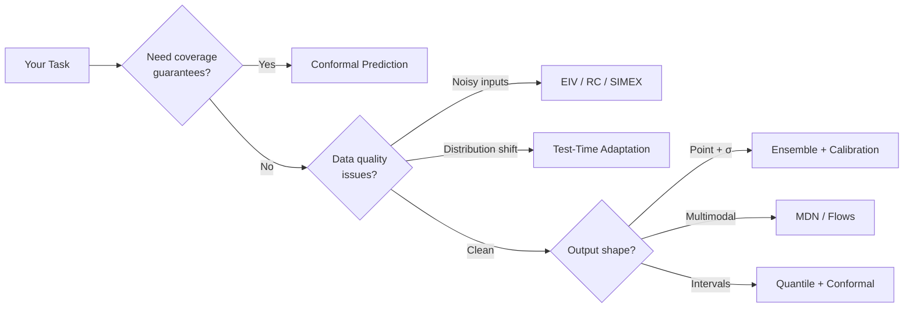

# Methods

While [loss functions](../losses/index.md) define *what* your model
optimizes, the **methods** in this section define *how* to extract reliable
uncertainty, correct for data issues, and validate your results.

Use the taxonomy below to find the right method for your task, or read each
section in order — the flow goes from most commonly needed (conformal,
ensembles) to more specialized tools (causal inference, PPI).

---

## Method Taxonomy

---

## Sections

### [Conformal Prediction](conformal/index.md)

Distribution-free prediction intervals with **finite-sample coverage
guarantees**. Wrap any pre-trained model for calibrated intervals —
Split conformal (fast baseline), CQR (heteroscedastic), CTI (multimodal),
and density-aware variants. **Start here if you need coverage guarantees.**

### [Ensembles for Uncertainty](ensemble/index.md)

Deep Ensembles, BatchEnsemble, SWAG, MC-Dropout, BNN — epistemic uncertainty
via member disagreement; aleatoric decomposition when members predict variance
(e.g. `HeteroscedasticEnsembleModel`). **Start here if you need to know what
the model doesn't know.**

### [Algorithms](algorithms/irls.md)

Specialized training algorithms: [IRLS](algorithms/irls.md) for robust
fitting, [RC](algorithms/rc.md) and [SIMEX](algorithms/simex.md) for
measurement error correction, [TIC-TAC](algorithms/tictac.md) for covariance
learning, [Heteroscedastic Laplace](algorithms/heteroscedastic_laplace.md)
for last-layer Bayesian regression, and
[Adaptive Prior VI](algorithms/adaptive_prior_vi.md) for covariate-shift
robustness. **Start here if standard training isn't enough for your data.**

### [Test-Time & Shift](test-time/bayesian-linear-regression.md)

Adapt models at deployment without retraining: Bayesian linear heads for
closed-form posterior updates, OT-based conformal reweighting for covariate
shift, and shift-factored predictive transport. **Start here if your test
distribution differs from training.**

### [Post-Hoc Calibration](calibration.md)

Improve uncertainty quality after training: variance temperature scaling,
isotonic mean calibration, PIT calibration. One-line API, no retraining
needed. **Always calibrate before trusting your intervals.**

### [Constraints](constraints.md)

Enforce structural properties on model outputs: non-negativity, bounded
ranges, simplex, monotonic quantile curves, Lipschitz bounds. Drop-in
`nn.Module` wrappers. **Start here if your domain requires hard output
constraints.**

### [Causal Inference](causal.md)

Doubly-robust ATE / CATE estimation with cross-fitting and overlap
diagnostics. **Start here if you need treatment-effect estimates under
confounding.**

### [Prediction-Powered Inference](inference.md)

Confidence intervals under limited labels — combine a small trusted-labeled
set with a large model-predicted pool for efficient statistical inference.
**Start here if you have abundant unlabeled data but scarce labels.**

### [Visualization](visualization.md)

Diagnostic plots for calibration, residuals, learning curves, and method
comparisons. **Start here when you want to visually validate your model's
behavior.**

---

## Next steps

- [Loss Functions catalogue](../losses/index.md) — every loss with formulas
- [Method Selection Matrix](../guide/method-selection.md) — task-first capability matrix
- [Metrics](../metrics/index.md) — evaluate your results rigorously
