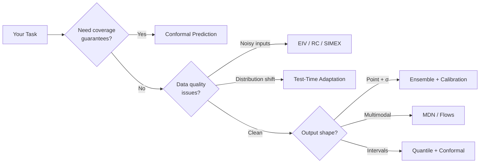

# Methods

Beyond loss functions, torchregress provides a suite of **methods** for uncertainty quantification, calibration, and robust inference. This page is the entry point.

---

## Method Taxonomy

---

## Sections

### [Conformal Prediction](conformal/index.md)

Distribution-free prediction intervals with **finite-sample coverage guarantees**. Split conformal, CQR, CTI, distributional conformal.

### [Ensemble & UQ](ensemble/index.md)

Deep Ensembles, BatchEnsemble, SWAG, MC-Dropout, BNN — with aleatoric/epistemic decomposition.

### [Algorithms](algorithms/irls.md)

Classical statistical algorithms: IRLS for robust regression, Regression Calibration and SIMEX for measurement error correction.

### [Test-Time & Shift](test-time/bayesian-linear-regression.md)

Bayesian linear heads for test-time posterior updates, OT-based shift-aware conformal prediction.

### [Post-Hoc Calibration](calibration.md)

Variance temperature scaling, isotonic calibration, PIT calibration — applied after training.

### [Constraints](constraints.md)

Output-head constraints: bounded predictions, monotonicity, simplex, spectral norm.

### [Causal Inference](causal.md)

Doubly-robust ATE/CATE estimators with overlap diagnostics.

### [Prediction-Powered Inference](inference.md)

Confidence intervals under limited labels using a larger prediction-only pool.

### [Visualization](visualization.md)

Diagnostic plots, calibration curves, reliability diagrams, training monitoring.
