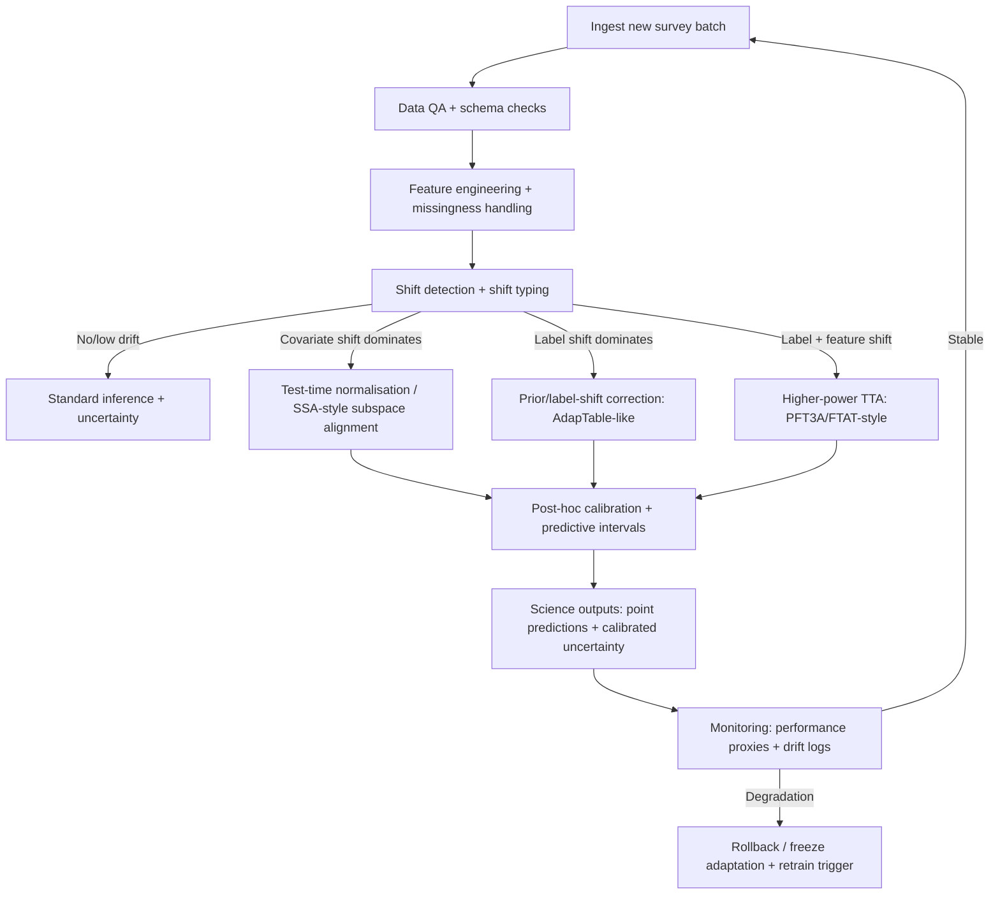

# Latest Test-Time Strategies for Robust Tabular ML Under Distribution Shift

## Executive summary

Tabular robustness under real distribution shift is now benchmarked well enough (notably via entity["organization","TableShift","tabular shift benchmark"]) to support a few high-confidence conclusions: (i) on “natural” shifts, stronger in-distribution (ID) tabular models tend to be stronger out-of-distribution (OOD) as well, but *no single model family or robustness recipe dominates across tasks*; and (ii) many popular vision-style test-time adaptation (TTA) algorithms (entropy minimisation, pseudo-labelling, some continual TTA variants) often fail to improve—and can degrade—tabular performance without tabular-specific design. citeturn13view0turn15view0turn24view2turn34view2

Across 2020–2026, the best-performing *tabular-specific* test-time methods converge on a common idea: **explicitly handle label shift and feature shift**, and avoid fragile “cluster assumption” updates that can collapse tabular models. In current evidence, the top tier for *classification* robustness on TableShift-like benchmarks is led by:

- **PFT3A (ICLR 2026)**: a *prior-free* (no source data, no source class priors) TTA method that combines batch-wise class-prior estimation with feature/subspace alignment. It reports large average gains vs no adaptation and also beats strong tabular TTA baselines (including FTAT). citeturn33view2turn35view2turn34view2  
- **FTAT/“Fully Test-time Adaptation for Tabular Data” (AAAI 2025 / arXiv 2024)**: an online method with confident label-distribution optimisation, a local consistency weighting scheme, and a dynamic model ensemble that reduces sensitivity to hyperparameters and to shift composition. citeturn27view1turn27view2turn27view3turn25view0  
- **AdapTable (NeurIPS TRL Workshop 2024; arXiv 2025 rev.)**: a two-stage, *output-level* method (shift-aware uncertainty calibration + label-distribution handling) that can deliver very large accuracy jumps under label shift without backpropagating through the base tabular model at test time (helpful when you cannot/should-not update the deployed predictor). citeturn24view2turn23view5turn17view1  
- **TabLog (ICML 2024)**: a rule-ensemble/logical-neural-network approach that assumes logical rule structure is invariant and adapts numeric parameters/weights with unlabeled target data; it shows consistent gains on several TableShift tasks. citeturn38view0turn36view0  

For *regression* (photo‑z, stellar parameters), the most directly applicable “modern TTA” result in 2020–2026 is **SSA (ICLR 2025)**: regression TTA via **significant-subspace alignment**, motivated by regression features living in a low-rank subspace; it shows improvements in \(R^2\) and highlights why naïve feature alignment can diverge. (It includes a tabular regression dataset result—California Housing—in its main table.) citeturn39view0

For astrophysics workflows specifically: the most robust “deployment-ready” pattern is **(1) strong base model + (2) shift detection and shift-type diagnosis + (3) low-risk test-time correction (calibration / label-prior correction / normalisation) as default + (4) higher-power TTA (PFT3A/FTAT-style) only when drift is sustained and monitored**. This is compatible with both regression and classification and scales naturally to survey-style streams/batches. citeturn17view4turn24view2turn27view3turn35view2

## Distribution shift taxonomy for tabular astrophysics

Astrophysics tabular ML (photo‑z, stellar parameters; plus classification variants such as redshift binning, quality flags, object type, “good/bad fit”) commonly experiences multiple shifts simultaneously, but three canonical components are still a useful organising lens:

**Covariate shift**: \(p(x)\) changes while \(p(y\mid x)\) is stable (e.g., photometry noise properties change with observing conditions; selection functions alter colour–magnitude distributions). Methods that only require unlabeled target features can help here (feature alignment, test-time normalisation, some TTA). citeturn13view0turn39view0turn27view2  

**Label shift / prior shift**: \(p(y)\) changes while \(p(x\mid y)\) is stable enough (e.g., redshift distribution differs between spectroscopic training and photometric inference; class imbalance changes over time). Label-shift-aware test-time methods (AdapTable, FTAT, PFT3A) focus heavily on estimating and correcting target label distributions without labels. citeturn23view3turn27view2turn34view2  

**Concept shift**: \(p(y\mid x)\) changes (e.g., a new instrument bandpass, deblender change, or photometric pipeline version changes the mapping from fluxes to physical parameters). Unlabeled-only methods are fundamentally limited here; practical mitigation usually needs *either* labelled target data, *or* strong invariances baked into training, *or* physics-informed features/sim-to-real calibration. TableShift explicitly notes that performance gaps can reflect mixtures of these shifts and that disentangling them is non-trivial. citeturn13view0  

Two shift types show up especially often in survey operations and map cleanly onto recent tabular work:

- **Feature shift (feature distribution and/or representation shift)**: the marginal distributions of columns change; also includes sensor/pipeline changes that alter column semantics. PFT3A frames “feature shift + label shift” as the key pair for tabular TTA design. citeturn28view0turn35view2  
- **Feature-space shift**: the *set* of available features changes (missing filters, new bands, reprocessing that adds/removes columns). This is benchmarked explicitly in TabFSBench (2025). citeturn0search25  

## Benchmarks and what they show about robustness at scale

The strongest “general” reference point for modern tabular distribution shift is **TableShift**: 15 binary classification tasks with curated real shifts and consistent APIs/baselines. citeturn13view0turn17view4  

### What TableShift implies for practice

**ID and OOD performance are strongly correlated** on TableShift: improving the base predictor is usually not wasted effort for OOD, even though it is not sufficient. citeturn13view0  

**No method eliminates shift gaps** and no model consistently dominates across tasks; robustness methods can reduce shift gaps but often trade off ID accuracy. citeturn13view0turn15view0  

**Label shift correlates with shift gaps**; moreover, TableShift reports that label-shift robustness methods included in their study did not remove these gaps and often hurt both ID and OOD accuracy—one reason newer tabular TTA methods explicitly re-estimate and correct label distributions rather than assuming “balanced source”. citeturn13view0turn15view0turn23view3  

### Scale regimes covered by recent tabular TTA

Recent tabular TTA papers increasingly report scales comparable to large survey catalogues:

- **FTAT** evaluates on TableShift tasks chosen for “notable degradation” and reports experiments spanning roughly **10K to 5M samples** and **26 to 365 features**, using batch size 512 at test time. citeturn27view3turn26view5  
- **PFT3A** uses five TableShift datasets and similarly states sample sizes **10K–5M** and feature dimensions **26–365**, and fixes a common hyperparameter set across datasets (emphasising reduced tuning burden). citeturn34view4turn29view5  

For astrophysics, this matters: photo‑z and stellar pipelines can be (a) batch-mode (nightly/weekly reprocessing) or (b) streaming (alert-like). These papers most directly support batch/mini-batch adaptation, and both explicitly discuss batch sizing and the need for stable statistics. citeturn27view3turn32view3  

## Test-time methods and empirical results on tabular data under shift

This section prioritises methods with (a) explicit tabular evaluation under shift, (b) recent (2020–2026) primary sources, and (c) scalable designs.

### Tabular-specific test-time adaptation

**PFT3A (Prior-Free Tabular Test-Time Adaptation; ICLR 2026)**  
Core algorithm: online batch-wise splitting into “source-like” vs “target-like” samples via prediction entropy, then (i) **Class Prior Estimating** to calibrate predictions under label shift without source priors, (ii) **Robust Feature Learning** via distribution alignment (closed-form KL under Gaussian assumptions in a learned subspace), and (iii) **Representative Subspace Exploration** (PCA-style) to avoid over-aligning redundant dimensions. citeturn32view3turn33view0turn34view2  

Assumptions: unlabeled target batches arrive sequentially; entropy can separate comparatively source-like vs target-like examples; feature alignment in a low-dimensional representative subspace is beneficial; concept shift is not directly modelled. citeturn32view3turn33view0  

Unlabeled test data required: yes, batch/streaming unlabeled target features. Source data not required; source class prior not required (explicit design goal). citeturn28view0turn34view4  

Hyperparameters (as reported): a fixed set across datasets is emphasised (e.g., \(\beta_1=1.0, \beta_2=0.1, m=5, \zeta=0.7\)), with adaptive entropy thresholds defined via percentile. citeturn29view5turn32view4turn29view4  

Compute & memory: requires model updates at test time plus per-batch statistics/PCA-like operations; exact wall-clock is not standardised in the paper text captured here, but the method is designed for the TableShift 26–365 feature regime. Inference-time memory is at least the model weights plus buffers for batch features and subspace stats. (Exact GPU/CPU timings are not specified in the extracted sections.) citeturn34view4turn32view3  

Typical gains (TableShift datasets, five tasks):  
- With **TabTransformer backbone**, average accuracy improves from **60.77 → 68.59** (+7.82 points), and PFT3A exceeds FTAT by **+4.34 avg Acc**, **+1.85 avg BAcc**, **+6.27 avg F1**. citeturn33view2turn35view3  
- With **MLP backbone**, average accuracy improves from **62.78 → 69.25** (+6.47 points). citeturn33view3turn34view2  
- With **FT‑Transformer backbone**, average accuracy improves from **59.45 → 68.01** (+8.56 points). citeturn35view2  

Failure modes: the paper notes degradation under severe shifts and sensitivity to small batches (suggesting sliding windows for stability); it explicitly flags adversarially manipulated source models as a risk. citeturn29view4turn29view5  

Suitability: strong for **classification**; the design is label-prior/categorical-output oriented. For **regression**, its core “label prior” module does not transfer directly; the subspace-alignment concept does. citeturn33view0turn39view0  

Open-source: implementation is reported as available (GitHub link in paper). citeturn28view0  

**FTAT (Fully Test-time Adaptation for Tabular Data; AAAI 2025 / arXiv 2024)**  
Core algorithm: three modules—(i) **Confident Distribution Optimiser** (align predictions with estimated, shifted label distribution using low-entropy samples), (ii) **Local Consistent Weighter** (weights samples to stabilise adaptation under covariate shift), and (iii) **Dynamic Model Ensembler** (maintains multiple learners with different learning rates and ensembles online to reduce sensitivity). citeturn25view0turn27view0turn27view3  

Assumptions: batched/streaming unlabeled test data; label and covariate shifts both present; entropy can identify confident samples; ensembling mitigates brittle hyperparameter choices. citeturn27view0turn27view1turn27view3  

Unlabeled test data required: yes; source data is not used at adaptation time (AdaTab setting). citeturn25view0turn27view0  

Hyperparameters (explicit in appendix): test batch size 512; ensemble of three base learners with different learning rates; key parameters include \(\alpha\), \(\epsilon\), \(\beta\) with example fixed values reported; entropy-based selection uses \(p\) thresholds. citeturn27view3turn26view1  

Compute & memory:  
- Compute scales with **(number of ensemble members) × (per-batch gradient updates)**.  
- Memory is **multiple model copies** (e.g., three learners) + optimiser state, making it heavier than output-only methods. citeturn27view3turn26view1  

Typical gains (TableShift subset; MLP, six datasets):  
- Average across datasets/backbones (Table 3): FTAT achieves best overall metrics; for MLP, **Acc 66.77 / BAcc 64.96 / F1 72.00** vs non-adaptation **Acc 62.45 / BAcc 64.61 / F1 60.59**. citeturn27view1  
- Per dataset (Table 4, MLP backbone), large HELOC improvements: **Acc 54.37 → 64.09**, **BAcc 58.25 → 63.64**, **F1 40.02 → 67.80**. citeturn27view2  

Failure modes: early analysis shows common FTTA methods degrade as shift severity increases (DIABETES→HELOC→ASSIST in their ordering); the method is built around mitigating this, but it still depends on stable entropy-based selection and batch statistics. citeturn27view0turn26view2  

Suitability: **classification-first** (explicit label-distribution machinery). For regression, you would need an alternate objective (see SSA below). citeturn25view0turn39view0  

Open-source: official code repository is indicated. citeturn17view2turn27view3  

**AdapTable (NeurIPS TRL Workshop 2024; arXiv v4 2025)**  
Core algorithm: deliberately avoids unstable backprop-based entropy minimisation in tabular settings; instead performs **output-probability correction** in two stages: (i) a **shift-aware uncertainty calibrator** that predicts per-sample temperatures using “shift information” and column relationships (graph-based), and (ii) a **label distribution handler** that estimates target class proportions online and adjusts predicted probabilities using Bayes-style reweighting, modulated by uncertainty. citeturn22view0turn24view1turn23view3  

Assumptions: tabular TTA failures stem from under-confident entropy distributions and complex decision boundaries; label shift and class imbalance are common in tabular shifts; batch-wise label distribution is locally smooth in time (“temporal locality” for streaming batches). citeturn22view0turn24view1turn23view3  

Unlabeled test data required: yes, target batches; additionally assumes access to **source marginal label distribution** (they state this similarly to TTT++). citeturn24view1  

Hyperparameters (shown as sensitive): smoothing factor \(\lambda\), lower/upper uncertainty quantiles, temperature scaling hyperparameter; they also report baseline TENT sensitivity to learning rate and adaptation steps under HELOC to illustrate brittleness. citeturn23view5turn24view1  

Compute & memory:  
- Test time: primarily forward passes + lightweight batch statistics + probability transforms (no base-model gradients).  
- Additional “post-training” time for the calibrator is reported; for example, **~9.27 s** (FT‑Transformer + HELOC) and **~281 s** (TabNet + Diabetes Readmission) in their timing table. citeturn23view5  

Typical gains (TableShift natural shifts; Table 2): conventional TTA baselines frequently do not help and sometimes degrade, while AdapTable produces large jumps:  
- **MLP on HELOC**: **47.0 → 64.5** accuracy (∆ +17.5).  
- **FT‑Transformer on HELOC**: **43.4 → 60.3** (∆ +16.9).  
- Even tree baselines can improve via output correction: **CatBoost 54.7 → 65.6** on HELOC with “+AdapTable”. citeturn24view2turn23view5  

Failure modes: because it manipulates outputs (not representations), it can struggle under genuine concept shift where calibration/priors are insufficient; its label-handler relies on batch-level class-proportion estimation, which becomes noisy in very small batches or rapid drift (not fully quantified in the visible excerpts). citeturn24view1turn39view0  

Suitability: **classification** (especially label shift) is primary; for regression you can reuse the *shift-aware calibration intuition* but not the label-prior correction directly. citeturn22view0turn39view0  

Open-source: code and benchmark scripts are provided. citeturn17view1turn16view1  

**TabLog (ICML 2024)**  
Core algorithm: learns a **weighted rule ensemble** represented as a logical neural network; assumes **logical structure of rules remains invariant** under shift, while numeric thresholds/weights can adapt; discretises numerical columns into learnable bins and uses a binning-informed contrastive loss for adaptation. citeturn36view0turn37view0turn38view1  

Assumptions: rule structure invariance; modest covariate shift can be handled by adapting rule parameters; complex feature dependencies can be represented by logical connectives. citeturn36view0turn38view0  

Unlabeled test data required: yes, for test-time adaptation loss; source data not required at adaptation time (as framed). citeturn36view0  

Hyperparameters & compute details (reported): experiments on an A100 GPU; SGD with momentum 0.9; batch size 64; 3 logical layers; 16 conjunction/disjunction modules per layer; contrastive temperature 0.1. citeturn38view0  

Typical gains (TableShift tasks with natural shift; Table 1): TabLog is top across four tasks:  
- ASSISTments: **62.64%** accuracy, **60.96%** Macro‑F1 (best in table).  
- Sepsis: **98.78%** accuracy, **49.70%** Macro‑F1 (best).  
- Hospital Readmission: **62.92%** accuracy, **62.81%** Macro‑F1 (best).  
- PhysioNet: **89.54%** accuracy, **48.03%** Macro‑F1 (best). citeturn38view0  

It also shows strong results under simulated corruptions across multiple datasets (Table 2), suggesting robustness to noise/missingness-style perturbations. citeturn38view1  

Failure modes: the key risk is **violated rule-structure invariance** (concept shift) or cases where discretisation/binning loses critical regression-like information; also, as a learned logical model, it may be heavier to train and integrate than “plug-in” probability correction. (These are implied by its design; explicit quantified failure cases are not fully specified in the extracted segments.) citeturn36view0turn38view0  

Suitability: evaluated for **classification**; to use for regression you would need a regression-capable rule formalism or discretised/ordinal framing. citeturn36view0turn39view0  

Open-source: code is explicitly linked. citeturn36view0  

### Regression-oriented test-time adaptation

**SSA (Significant‑subspace Alignment; ICLR 2025)**  
Core algorithm: regression TTA via **feature distribution alignment restricted to a detected significant subspace** (PCA-style), plus **dimension weighting** to emphasise feature directions most significant to the output; designed because regression features often occupy a low-rank subspace and naïve full-dimensional alignment can diverge. citeturn39view0  

Assumptions: **covariate shift** setting is assumed (\(p_s(x)\neq p_t(x)\) but \(p_s(y\mid x)=p_t(y\mid x)\)); model has a feature extractor; aligning distributions in a meaningful subspace helps. citeturn39view0  

Unlabeled test data required: yes; adaptation uses unlabeled target features. Source data is not needed at adaptation time if source feature statistics were precomputed. citeturn39view0  

Typical gains (reported \(R^2\)): includes a tabular regression dataset (California Housing) where **SSA improves \(R^2\) from 0.605 → 0.639**, while naïve feature alignment diverges (“-”) in that setting. citeturn39view0  

Compute & memory: requires PCA/subspace detection and per-batch feature-stat alignment; exact wall-clock depends on backbone and feature dimension. (The paper’s main extracted table emphasises dimensionality/rank rather than runtime.) citeturn39view0  

Failure modes: if the shift violates the covariate-shift assumption (i.e., concept shift), feature alignment can mis-adapt; also, very small effective ranks can make naïve alignment unstable, motivating SSA’s subspace restriction. citeturn39view0  

Suitability: **directly relevant to photo‑z / stellar parameter regression** because it is regression-native and not class‑prior based. citeturn39view0  

Open-source: code is linked by the authors. citeturn39view0  

### Lower-risk test-time “formulations” that scale well

These approaches are less “state-of-the-art TTA papers” and more *deployment primitives* that you can combine with the methods above.

**Test-time normalisation / re-standardisation**  
Mechanism: recompute (some) normalisation statistics on the current target batch or sliding window (e.g., robust scaling per feature; batch-stat updates in models that contain normalisation layers; or feature-stat alignment as in SSA). This is low overhead and often the first line of defence under covariate shift, but does not address label shift or concept shift by itself. citeturn39view0turn13view0  

**Test-time ensembling**  
Mechanism: average predictions across model checkpoints, stochastic passes, or light online ensembles. FTAT’s Dynamic Model Ensembler is a concrete tabular example that targets hyperparameter sensitivity and improves results over single learners. citeturn27view0turn27view1turn27view2  

**Robust calibration and uncertainty quantification under shift**  
Mechanism: shift-aware calibration (AdapTable’s uncertainty calibrator + probability correction), plus distribution-free predictive intervals/sets (conformal methods) and continuous monitoring. AdapTable explicitly motivates its design by documenting calibration failures (under- vs over-confidence depending on dataset) and using uncertainty to decide which predictions to adjust. citeturn22view0turn24view0turn23view5  

**Domain generalisation / robust training as pre-deployment complements**  
Mechanism: training-time methods (IRM, V‑REx, CORAL/MMD, Group DRO, MixUp, adversarial/domain-invariant learning). TableShift finds these can reduce gaps but often reduce ID accuracy and still do not eliminate OOD gaps; think of them as “shift hardening” rather than a substitute for test-time monitoring/adaptation. citeturn13view0turn15view0turn15view1  

## Comparative analysis and recommendations for photo‑z and stellar parameters

### What the recent evidence implies for astrophysics tabular ML

1) **Start with a strong baseline and evaluate under realistic splits.** On TableShift, strong gradient-boosted trees and strong deep tabular models are tightly clustered in OOD performance on average; e.g., across domain-generalisation tasks CatBoost and FT‑Transformer achieve among the best OOD accuracies (~0.794), but gaps remain (ID > OOD). citeturn15view1turn15view0  

2) **Label shift is a major driver of performance drops.** Both TableShift and the newer tabular TTA papers centre label distribution changes as a key difficulty and design constraint; in astrophysics this maps directly onto spec‑z vs photo‑z redshift distribution mismatch and survey selection effects. citeturn13view0turn23view3turn34view2  

3) **Use low-risk corrections by default; reserve backprop-based TTA for sustained drift with monitoring.** Output-level correction (AdapTable-like) can yield large gains with less operational risk than online parameter updates; when you do update parameters (FTAT/PFT3A), you must add safeguards against catastrophic adaptation (batch sizing, rollback, canary evaluation). citeturn24view2turn27view2turn29view4  

4) **For regression, use regression-native TTA + calibrated uncertainty.** SSA provides a concrete regression TTA template aligned with how deep regressors represent data (low-rank subspaces) and shows naïve alignment can diverge; this is conceptually close to what you want for photo‑z/stars when covariate shift dominates. citeturn39view0  

### Comparison table

| Method (year) | Test-time update target | Shift types explicitly handled | Needs unlabeled target batches | Needs source data / priors at test time | Typical gains under shift (representative numbers) | Scalability & compute | Implementation complexity | Reproducibility & code | Photo‑z / stellar parameters recommendations |
|---|---|---|---|---|---|---|---|---|---|
| **PFT3A (2026)** citeturn33view2turn35view2 | Model parameters + calibrated outputs | Label shift + feature shift (subspace alignment) | Yes (online batches) citeturn32view3 | No source data; no source priors (prior‑free) citeturn28view0 | Avg Acc +6–9 points vs Non‑Adaptation across backbones (e.g., 60.77→68.59) citeturn33view2turn35view2 | Moderate–high: per-batch updates + PCA/subspace stats; designed for 26–365 features, 10K–5M samples citeturn34view4turn29view5 | High | Code link reported citeturn28view0 | **Classification**: strong default when you can do controlled online adaptation. For regression, reuse subspace alignment ideas but not prior module. |
| **FTAT (2025)** citeturn27view2turn27view3 | Model parameters + online ensemble | Label shift + covariate shift + sensitivity mitigation | Yes (online batches) citeturn27view3 | Source data not used at test time (AdaTab) citeturn25view0 | Large HELOC gains (Acc 54.37→64.09; F1 40.02→67.80) citeturn27view2 | High: multiple learners (memory) + backprop per batch; batch size 512 citeturn27view3 | High | Official repo + datasets page citeturn17view2turn27view3 | **Classification**: good when you can afford compute and want robustness to tuning. Useful for redshift-bin classification or QC flags. |
| **AdapTable (2024/2025)** citeturn24view2turn23view5 | Output probabilities (plus a calibrator model) | Label shift + calibration failures (shift-aware) | Yes (batches) citeturn24view1 | Uses source marginal label distribution (as stated) citeturn24view1 | HELOC Acc jumps of ~+17 points (MLP 47.0→64.5; FT‑Transformer 43.4→60.3) citeturn24view2 | Lower-risk at deployment: no base-model gradients; calibrator post-training seconds–minutes depending on scale citeturn23view5 | Moderate | Official repo + TableShift scripts citeturn17view1 | **Best “safe default”** for classification when you cannot update the deployed model. Consider for redshift-bin classification and catalogue-level class-prior drift. |
| **TabLog (2024)** citeturn38view0turn36view0 | Rule thresholds/weights (logical model) | Covariate shift (via rule parameter adaptation); assumes rule-structure invariance | Yes | Source data not needed at adaptation time (as framed) citeturn36view0 | Best on 4 TableShift tasks; e.g., ASSISTments Acc 62.64, Macro‑F1 60.96 citeturn38view0 | Moderate–high: specialised model + adaptation loss; batch size 64; A100 used citeturn38view0 | High | Code link reported citeturn36view0 | **Classification**: interesting if you believe stable logical invariants exist (e.g., physically motivated cuts/regions). Less direct for pure regression photo‑z unless reformulated. |
| **SSA (2025)** citeturn39view0 | Feature extractor (alignment in significant subspace) | Covariate shift (explicit assumption) | Yes | No source data at test time if stats cached citeturn39view0 | California Housing \(R^2\) 0.605→0.639; naïve alignment diverges citeturn39view0 | Moderate: PCA/subspace + alignment; depends on backbone | Moderate | Code link reported citeturn39view0 | **Regression**: strongest direct match to photo‑z / stellar parameter regression when covariate shift dominates (survey depth/seeing). |
| **TableShift DG/robust training (2023)** citeturn13view0turn15view1 | Training-time objectives | Mixed (domain generalisation/robustness) | Not required | N/A | Often small/variable; can reduce shift gaps but reduce ID accuracy citeturn13view0 | Training cost upfront; inference unchanged | Moderate | Benchmark + Docker + guides citeturn17view4turn17view5 | Use as **pre-deployment hardening**, not as sole defence; pair with monitoring + test-time correction. |
| **Basic test-time normalisation** citeturn39view0 | Preprocessing stats / normalisation layers | Covariate shift (limited) | Yes (window) | No | Gains highly task-dependent; not consistently reported as SOTA in these papers | Very high scalability; minimal overhead | Low | Easy | Good default for photometry scaling drifts; insufficient alone for label/concept shift. |
| **Feature-space shift benchmarks (TabFSBench, 2025)** citeturn0search25 | N/A (benchmark) | Feature-set changes | N/A | N/A | N/A | Helps evaluate missing-filter / new-band scenarios | N/A | Paper/code varies | Use to stress-test survey-to-survey feature mismatches (missing bands, reprocessing columns). |

### Recommended deployment pipeline for astrophysics tabular workflows

Operational notes grounded in the tabular TTA literature:

- Prefer **batch or sliding-window adaptation** (most methods assume batches and stable statistics). citeturn32view3turn27view3  
- Maintain a **non-adapted “anchor” model** and a rollback path; both AdapTable and FTAT/PFT3A motivate this by showing many generic TTAs underperform Non‑Adaptation on tabular. citeturn24view2turn33view1turn27view0  
- Separate **science-grade uncertainty** from “internal adaptation signals”: use calibrated uncertainty/intervals for downstream astrophysical inference, while using drift metrics to decide whether to adapt. (AdapTable explicitly ties adaptation to calibration quality and uncertainty.) citeturn22view0turn24view0  

## References and resources

Primary benchmarks and baseline landscape:

- **TableShift (NeurIPS 2023 Datasets & Benchmarks)**: benchmark and large-scale baseline study; includes Docker workflow and scripts. citeturn13view0turn17view4turn15view0turn15view1  

Tabular test-time adaptation (classification):

- **AdapTable (NeurIPS TRL Workshop 2024; arXiv 2025)** + official code. citeturn22view0turn24view2turn23view5turn17view1  
- **Fully Test-time Adaptation for Tabular Data / FTAT (AAAI 2025; arXiv 2024)** + official code. citeturn25view0turn27view2turn27view3turn17view2  
- **Prior‑free Tabular Test‑time Adaptation / PFT3A (ICLR 2026)** + implementation link reported in paper. citeturn28view0turn34view2turn35view2  
- **TabLog (ICML 2024)** + code link reported in paper. citeturn36view0turn38view0turn38view1  

Regression test-time adaptation:

- **Test‑time Adaptation for Regression by Subspace Alignment (ICLR 2025)** + code link reported in paper; includes a tabular regression result (California Housing). citeturn39view0  

Feature-space shift:

- **TabFSBench (2025)**: benchmark for tabular feature shifts (feature-set changes). (Details beyond the abstract-level description are not fully specified in the sources retrieved here.) citeturn0search25